<div align="center">

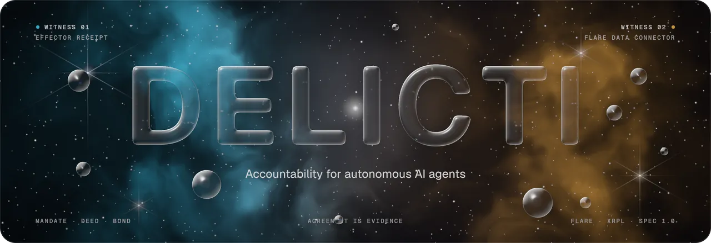

**Accountability for autonomous AI agents.** The principal commits a mandate before the agent acts. An independent witness confirms each deed. If the agent breaks the mandate, its bond pays for the breach, and no court is involved.

*Spending limits that hold across a sequence of calls · cross-chain proof of what an agent did, on EVM and XRPL · proportional slashing · watcher bots paid to keep the record*

[](https://github.com/dziuba0x/delicti/actions/workflows/test.yml)
[](https://github.com/dziuba0x/delicti/releases)


[](SPEC.md)


[](LICENSE)

[The problem](#the-problem-every-call-was-allowed) · [How it works](#how-it-works) · [A case, end to end](#a-case-end-to-end) · [What it can prove](#what-it-can-prove-and-where) · [Proven on-chain](#proven-on-chain--click-any-of-them) · [Watchers](#watchers-the-watch-pool-and-the-sentinel) · [Quickstart](#quickstart) · [Contracts](#contracts-v015-on-coston2) · [Limits](#limits-stated-up-front) · [FAQ](#faq) · [SPEC](SPEC.md)

</div>

---

> **TL;DR** DELICTI is an open-source protocol, written in Solidity with a TypeScript SDK, that makes AI agents with wallets answerable for what they do. The principal commits a mandate on-chain: a budget, a time window, an asset and a delegation tree. The agent accepts it and posts a bond. The [Flare Data Connector (FDC)](https://dev.flare.network/fdc/overview) then attests, from consensus, what the agent actually did on Ethereum, Flare, Songbird or the XRP Ledger. When the sum of those deeds breaks the mandate, a smart contract slashes the bond in proportion to the breach. There are no jurors, no votes and no admin key. It works with **x402** payments, **MCP** tool servers and **stablecoins** (USDT0, USDC.e, FXRP), and with receipts from agents that never send a transaction themselves.

## The problem: every call was allowed

An agent with a wallet is told *"spend at most 4"*, and then spends 1 five times. Each call passes its per-action policy check. Each call gets a signed receipt. Every receipt is true, and the mandate was still broken. In finance this is called **structuring**, or salami slicing.

<picture>
  <source media="(prefers-color-scheme: dark)" srcset="assets/structuring-dark.svg">
  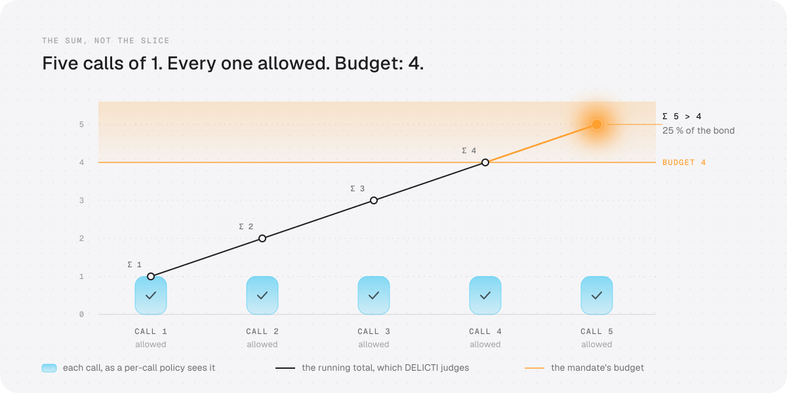
</picture>

Receipts show that something was *registered*. Policies approve one *slice* at a time. Neither of them sees the sum, and neither can confirm that the effect happened in the world. DELICTI adds both of those, and then makes the breach cost the agent something.

> *"The intelligence produced by scaling deep learning is not directly comparable to human intelligence."*
> — Jakub Pachocki, Chief Scientist of OpenAI, [*An Alien Mind*](https://openai.com/index/an-alien-mind/)
>
> When a mind becomes alien, its words stop being evidence. Its deeds, confirmed independently, remain. That is the thesis DELICTI is built on.

## How it works

DELICTI does not add another receipt format. It consumes the signed receipts that effectors already produce: flario `x402_receipt`, KYA-OS / Checkpoint `_meta` proofs, ACTA / ASQAV receipts. On top of them it adds five things none of those formats have:

1. **Mandate before act.** A principal commits on-chain what the agent may do: a budget, a time window, the asset and chain the budget is counted in, and a delegation tree in which a child can only narrow its parent. The agent must **acknowledge** the mandate before any bond is accepted.
2. **Two witnesses to the same deed.** The effector's receipt is witness one. An FDC attestation of the effect in the world is witness two. When they agree, that is evidence. When they disagree, it is a *contradicted deed*.
3. **The sum, not the slice.** Violations are computed against the mandate's cumulative budget. Structuring is caught even when every single action was allowed.
4. **A brake that sees the sequence.** An effector that knows about DELICTI reads the running tally before it acts. It refuses the fifth slice with one `eth_call`, in milliseconds, before any funds move. An effector that skips the check has chosen to be judged by the FDC instead, minutes later.
5. **Consequence without a court.** When a breach is proven, the bond is slashed **in proportion to the breach**: a 25 % overrun takes 25 %, with a floor of 10 %. The watcher who proved it gets its attestation fees back plus 10 % of the rest. The party the breach harmed gets the remainder, and depositors take back whatever is left.

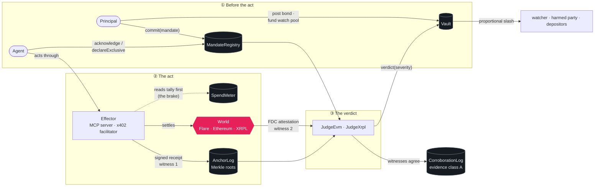

## A case, end to end

> *"AI interactions increasingly span days or months. Agents operate autonomously and act in the world."*
> — Wojciech Zaremba, co-founder of OpenAI, [on X](https://x.com/woj_zaremba/status/2094469674453111004)

A mandate spans days, and so does a case. This is how a stablecoin agent is convicted under §6.11 when it has no receipts at all. The agent only signs x402 authorizations and a facilitator sends the tokens. A watcher, which can be anyone, does the rest.

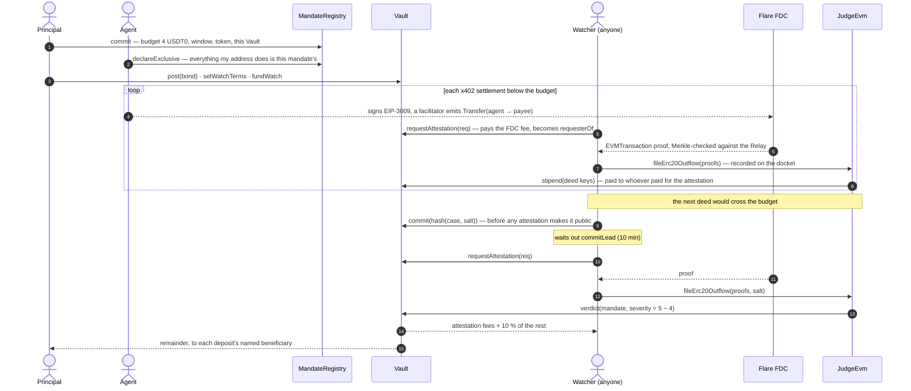

The commit–reveal gate (§6.7) keeps the reward with whoever found the case, not with whoever copies its calldata from the mempool. That copy was refused live on Coston2 (`CommittedTooLate`, linked below).

### Where the bond goes

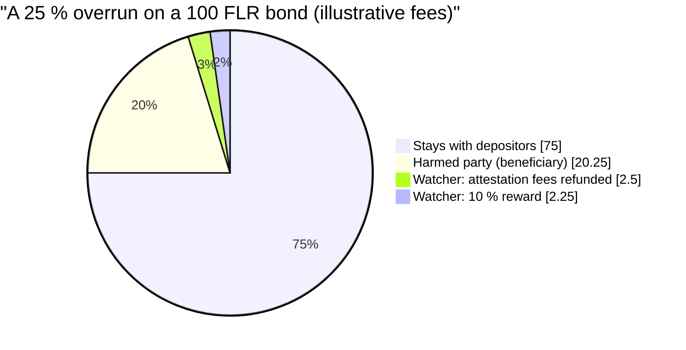

`P(S) = clamp(bond × S / budget, 10 % × bond, bond)`, where `S` is the mandate's total proven severity (SPEC §8.1). Each deposit compensates the beneficiary its depositor named (§8.3). As a result, a principal who colludes with its own agent cannot take an insurer's deposit. It can take at most the challenger's share.

### The life of a mandate

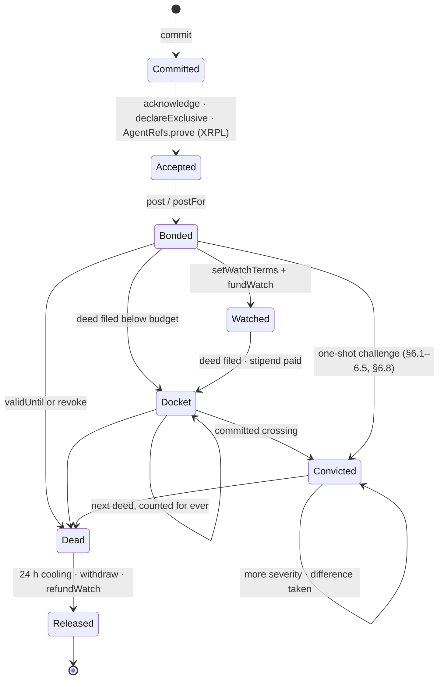

<sub>Simplified. A **docket** holds deeds that were filed once, while they could still be proven, and counts them for ever. This is how an XRPL mandate stays enforceable past the verifier's ~14-day memory.</sub>

## Why signed receipts are not enough

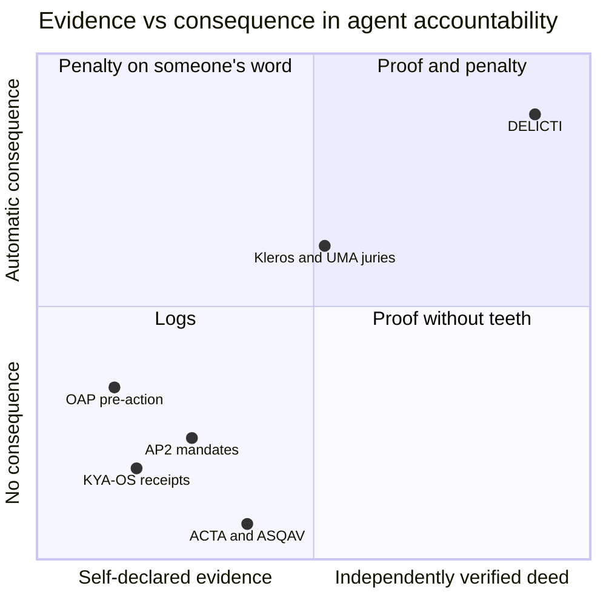

| | KYA-OS / Checkpoint | ACTA / ASQAV | AP2 mandates | OAP (pre-action) | Arbiter escrow (Kleros / UMA / LLM juries) | **DELICTI** |
|---|---|---|---|---|---|---|
| Effector-signed receipt | yes | gateway / operator | yes | gateway | – | consumes theirs |
| Commitment *before* the act | – | – | payments only | policy hash | deal terms | on-chain: budget, window, asset, delegation tree |
| Independent confirmation the effect happened | – | – | – | – | a judge decides | **FDC, from consensus** |
| Detects structuring across many small calls | – | – | – | admitted gap | – | **sum over the sequence** |
| Consequence | – | – | – | – | after a ruling | **on proof, proportional** |
| Survives the operator's bankruptcy | if they keep logs | Bitcoin / Rekor anchor | – | – | yes | neutral chain |

A receipt shows *registration*: "a false claim can be immutably registered". A court shows that someone was persuaded. DELICTI proves the *deed*, or proves that the receipt lied.

## What it can prove, and where

Every verdict rests on an FDC proof checked against the Merkle root of Flare's Relay. Here is the map from what the FDC can see to what DELICTI can judge:

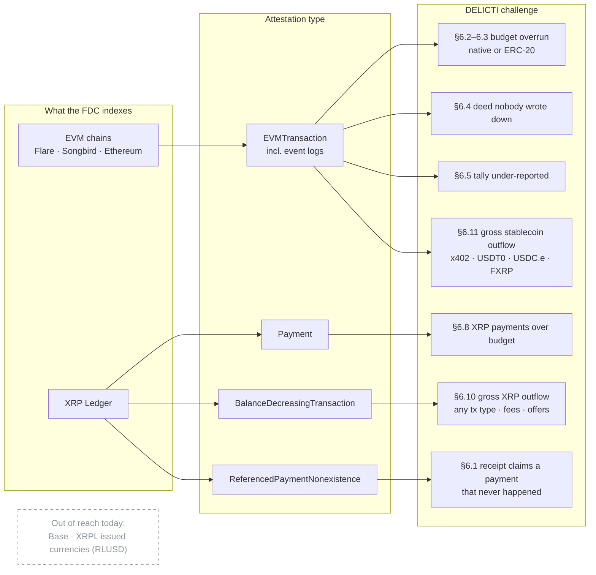

| Kind | Challenge | What it proves | FDC attestation | SPEC |
|---|---|---|---|---|
| 1 | `challengeFalsePayment` | the receipt claims a payment that never happened | `ReferencedPaymentNonexistence` | §6.1 |
| 2 · 3 | `challengeBudgetOverrun` | the sum of real deeds exceeds the budget, native (2) or ERC-20 (3), per the mandate | `EVMTransaction` | §6.2–6.3 |
| 4 | `accuseUnanchoredDeed` → `answerAccusation` / `resolveAccusation` | an exclusive agent acted and wrote nothing down | `EVMTransaction` | §6.4 |
| 5 | `challengeUnderReportedSpend` | the effector's tally said less than the world shows | `EVMTransaction` | §6.5 |
| 6 | `challengeBudgetOverrunPayment` · `fileBudgetPayments` | the same overrun, for XRP payments on XRPL, one-shot or on a docket | `Payment` | §6.8 |
| 7 | `fileXrpOutflow` | more XRP **left** the agent's account than the mandate allows: any transaction type, fees included, **no receipts**, including an offer consumed in someone else's transaction | `BalanceDecreasingTransaction` | §6.10 |
| 8 | `fileErc20Outflow` | more of the mandate's **stablecoin** (any ERC-20) **left** the agent's address than allowed, including x402 settlements the agent only **signed** and a facilitator sent, **no receipts** | `EVMTransaction` (events) | §6.11 |

<sub>Kind numbers are the ones SPEC v1.0 freezes in [`src/Kinds.sol`](src/Kinds.sol); they name a case in the commit–reveal preimage.</sub>

Every challenge sits behind a commit–reveal gate. Dockets (`file*`) record deeds below the budget without a commitment, and the watch pool (§8.4) pays whoever paid for those attestations. Only the committed crossing convicts.

## Proven on-chain — click any of them

Nothing below is a claim about what the contracts *would* do. Each line is a transaction on Flare's Coston2 testnet that anyone can open. [docs/DEPLOYMENTS.md](docs/DEPLOYMENTS.md) has the full record, with every deployment since v0.1.

| What was proven | Transaction |
|---|---|
| **v0.15: a copier filed a watcher's proofs first, and earned nothing.** The watch pool pays whoever paid for an attestation (through `Vault.requestAttestation`), not whoever files it. The rule came from an adversarial review of v0.14, which found the copier, with a working exploit, before v0.14 shipped | [`0xc7c8620e…374283`](https://coston2-explorer.flare.network/tx/0xc7c8620ef0813c946511fea5cc4f48b59aef510055a123d26dbcb86fd4374283) |
| **v0.14: the sentinel ran the protocol alone.** It discovered every mandate from state and read the XRPL accounts' histories through the FDC verifier's own index. It found outflows no one had filed, including an exclusivity statement's own fee, and convicted again. It caught an agent that had declared two overlapping exclusive mandates over one token. It was paid from a watch pool for keeping an honest docket, then again for the conviction | [`0x7a83ce5f…9001be`](https://coston2-explorer.flare.network/tx/0x7a83ce5fd73e185d63e95d4f3a432c8dc2528afd05aa4ab61a3580e9609001be) · stipends: [`0x950d5acb…d93583`](https://coston2-explorer.flare.network/tx/0x950d5acb7f8afe6ed8122bdcee2369d7e22f09c047a4ce6ff527bdb05cd93583) · [report](docs/sentinel/coston2-2026-09-24.html) |
| **The watcher bot convicted an agent on its own.** `delicti-watch` (SDK) found five x402 payments through the explorer. It filed the first three as a recording, then committed before any attestation existed, waited out the lead, proved the last two and filed the conviction. Nobody ran a script against this mandate | [`0x4735cd57…232bff`](https://coston2-explorer.flare.network/tx/0x4735cd5750935eeae918b7e477d0d90d977057132952192d007e628c22232bff) · recording: [`0xf93cd783…d6f077`](https://coston2-explorer.flare.network/tx/0xf93cd783087f95df0c30eb2f015afe527727917805490fdf12c85e72c6d6f077) |
| **v0.13: a stablecoin agent convicted from the token's own log.** Five x402 settlements of 1 mUSDT0. The agent only *signed* them (EIP-3009), a facilitator *sent* them, and there are no receipts. FDC `EVMTransaction` proofs of the `Transfer` logs were filed on a docket: three uncommitted, then the committed crossing. 5 against a 4-unit budget took 25 % of the bond (SPEC §6.11) | [`0x75d51613…071dea`](https://coston2-explorer.flare.network/tx/0x75d51613fed7a4d69fc84fce28654cfdc43e91cccfdf557a3a60326506071dea) · docket: [`0x122d1f14…23ca2c`](https://coston2-explorer.flare.network/tx/0x122d1f142a75d9ef15eea39cfbaff77fa68fb678ddb35f3a552e30f72723ca2c) |
| **v0.11: an agent convicted for a transaction it never signed.** 14 XRP left its account under a 12-XRP outflow budget, and 5 of those XRP left in someone else's transaction, which consumed the agent's offer | [docs/DEPLOYMENTS.md](docs/DEPLOYMENTS.md#live-on-coston2-2026-09-23--v011-and-an-agent-convicted-for-a-transaction-it-never-signed) |
| **v0.10: structuring on XRPL, live.** Five payments of 1 XRP under a 4-XRP budget. Each was proven by an FDC `Payment` attestation and matched to an anchored receipt. The agent's XRPL account confirmed the mandate itself, with a payment carrying the mandate's challenge in its memo. A 25 % overrun took 25 % of the bond | [`0xb6856090…62bcb89`](https://coston2-explorer.flare.network/tx/0xb6856090222fb3083d425bb22126f88fd35e66f14641a8b03c2cd2c4862bcb89) · control: [`0xa5c17d21…63cd8f`](https://coston2-explorer.flare.network/tx/0xa5c17d21eb4c5495ab58282921e98b0360977a729a00bdb31dfdb66f6b63cd8f) |
| **An XRPL deed that is not a payment, done inside someone else's transaction.** Another account took the agent's resting offer. FDC `BalanceDecreasingTransaction` attests that the agent's account lost 9 XRP in *that* transaction, and `FdcVerification` accepts the proof (SPEC §6.9) | request [`0xc5a32b7b…067b47`](https://coston2-explorer.flare.network/tx/0xc5a32b7b53d626a630e84108500878a5f1f850dd67feda46d0d3ce672e067b47) |
| **v0.9: proportional.** A 25 % overrun took 25 % of the bond, not all of it. Asset and source were read from the mandate, and the agent had acknowledged it | [`0x7c4c3094…8d8123`](https://coston2-explorer.flare.network/tx/0x7c4c3094585a4a1b5f473415d5cc39146a1b38def01b03030f65e3af5d8d8123) |
| A copier lifted a finished challenge out of the mempool. It was refused on-chain because it had not committed in time | [`0xab529327…4da115`](https://coston2-explorer.flare.network/tx/0xab52932730be8db7a8da1ec37396e5124f2033ec0e92f0baf98388c5464da115) *(reverted, `CommittedTooLate`)* |
| …and the same calldata, revealed two blocks later by the address that committed first | [`0xdbf70a53…9a7628`](https://coston2-explorer.flare.network/tx/0xdbf70a53b738e793b558b9f09a412f1727ec3c49a8899cd6f6700ab7fa9a7628) |
| **Structuring refused while it was still happening.** Four slices fit. The meter rejected the fifth, with no FDC round and no transaction at all | [meter state, mandate #1](https://coston2-explorer.flare.network/address/0xD64465B95A1E83DC292AcB1e5b66dD416ADeA55C) |
| The effector recorded two settlements out of five. The FDC proved five, and the tally was convicted of the difference | [`0x53664b9f…0b20ff`](https://coston2-explorer.flare.network/tx/0x53664b9f186353821ae8be87e75279d0de6619fd3326f3751974a616fb0b20ff) |
| A deed with no receipt behind it. Nobody answered, the window closed, and the bond went | [`0x432ca347…72490b`](https://coston2-explorer.flare.network/tx/0x432ca347481f7a279e377b648c5ad2b776f871b38ed0068b515383d63e72490b) |
| The same accusation, answered in time with the anchored receipt. It was dismissed and the accuser's stake forfeited | [`0x1bbcaf3f…6ae48b`](https://coston2-explorer.flare.network/tx/0x1bbcaf3f0a371facd17b8922d522e59917120f0055a2cca6954c3d38ba6ae48b) |
| The effector-side brake. A live mandate pays, and a missing, revoked or borrowed one is refused **before any funds move** | [`0x2b59d401…277664`](https://coston2-explorer.flare.network/tx/0x2b59d401f8819c24c8e6b89841f35b7df09a4282dd1b7607ad4db7505a277664) |
| The loop driven through a **running flario MCP server**. Witness 1 was emitted by the effector process, not built by hand | [`0x118bc486…d922f0`](https://coston2-explorer.flare.network/tx/0x118bc48692b986875c2153492ff81757da9d9bf18e4201341cb2711f50d922f0) |
| Structuring over x402: five genuine EIP-3009 settlements, genuine `flario-receipt/2`, and FDC proofs carrying the `Transfer` event | [`0x19c73850…014ed1`](https://coston2-explorer.flare.network/tx/0x19c738500129ff4447802561a804b92620e47f3222fa70a76c6ad781ce014ed1) |
| Structuring, native: five 1-FLR deeds under a 4-FLR budget. Each was legal alone and each was corroborated by the FDC. The sum convicts | [`0xa547ebad…96557f`](https://coston2-explorer.flare.network/tx/0xa547ebada6b01953100ed2fad6abdead1b3122d3d280ad302040e69b3f96557f) |
| A receipt that lied. It claims an XRPL payment, FDC `ReferencedPaymentNonexistence` proves the payment never happened, and the bond is slashed | [`0x91bb1909…5fdc91`](https://coston2-explorer.flare.network/tx/0x91bb190933e9e0d5abbc8efc2816ba26d475c2fa3cfbfb2636ae656e3c5fdc91) |

Every challenge type DELICTI defines has been executed on Coston2 at least once, in both directions where it has two. Here is what has **not** run live. The audit fixes of v0.10 (the tally judged as of the deed, one corroboration per deed per agent) are covered by `test/Audit.t.sol`, not by a transaction. `CorroborationLog` has never recorded a live deed.

## Watchers, the watch pool and the sentinel

Security needs one honest watcher, and anyone can be one. The hard part is getting someone to watch **an agent that behaves**, because a reward paid only on conviction pays nothing in exactly the case the protocol exists to produce. Lightning's watchtowers ran into this *deterrence paradox*. The fix in v0.14–v0.15 is a watch pool: the principal pays per new deed recorded, to whoever **paid** for that deed's attestation.

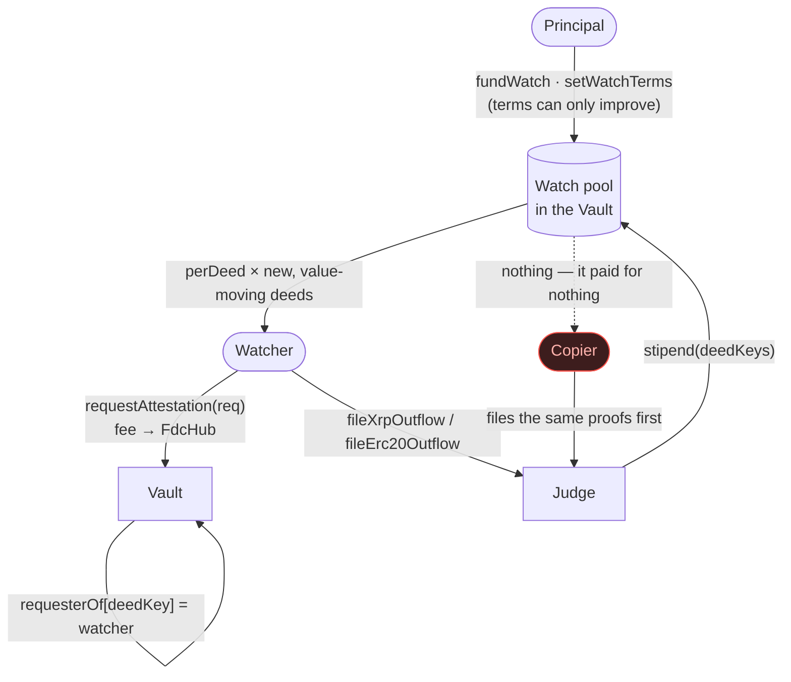

**Reading XRPL history the way the FDC will.** Public XRPL nodes keep little history; the testnet endpoint keeps about 1,300 ledgers. However, every transaction that moves an account's XRP modifies its AccountRoot and records the transaction that modified it before (`PreviousTxnID`). The balance history is therefore a linked list. The watcher walks it backwards through **the FDC verifier's own index**, which holds about 15 days of full transactions, so what it finds is exactly what can still be proven.

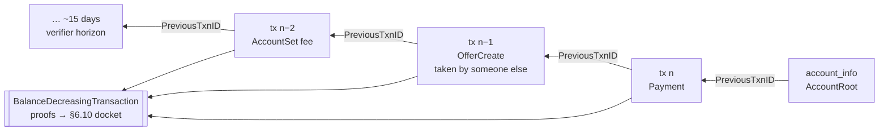

The SDK ships three watchers:

- `delicti-watch erc20 <id>` watches stablecoins on Flare (§6.11).
- `delicti-watch xrpl <id>` watches XRP outflow (§6.10).
- `delicti-watch sentinel` watches every mandate at once. It discovers mandates from state, prices each case before buying anything, and acts on a stated policy: `observe`, `profit` or `altruist`. It also publishes a per-agent **public score**: standing, verdicts, bond at stake, worst budget use, watch coverage, and flags for outflow not yet on a docket (SPEC §11.2). [Example report](docs/sentinel/coston2-2026-09-24.html).

[docs/research/watchers.md](docs/research/watchers.md) covers the design reasoning: what Lightning watchtowers, Forta, keeper networks, UMA and Kleros, rollup challengers and liquidation bots learned the hard way, and what DELICTI took from each.

## Quickstart

Requires [Foundry](https://book.getfoundry.sh/getting-started/installation) and Node 22.

```bash
git clone https://github.com/dziuba0x/delicti && cd delicti
npm ci                           # @flarenetwork/flare-periphery-contracts, OpenZeppelin
forge build
forge test                       # 226 tests with a mock FDC, 14 of them invariants (~1 min)
cd sdk && npm ci && npx tsc --noEmit && npx vitest run   # 28 SDK tests offline (one more runs with DELICTI_ONLINE=1)
```

### An agent under a mandate, in TypeScript

```ts
import { Delicti, coston2 } from "@delicti/sdk";   // build from ./sdk; not yet on npm

const delicti = new Delicti(coston2, publicClient);
const { id } = await delicti.commitMandate(principal, {
  agent: agent.account.address,
  terms: "may pay up to 4 USDT0 for data, via x402",
  budget: 4_000_000n,                              // token units (6 decimals)
  validFrom: now, validUntil: now + 86_400n,
  token: USDT0,                                    // omit for the native asset
});
await delicti.declareExclusive(agent, id);         // "everything my address does in the window is this mandate's"
await delicti.post(principal, id, parseEther("100"));
await delicti.setWatchTerms(principal, id, parseEther("1"), 100_000n);  // pay watchers per recorded deed
await delicti.fundWatch(principal, id, parseEther("10"));
console.log(await delicti.status(id));             // live, bond, severity, dockets, watch pool
```

### Replay a live case

Needs `cast`, `curl` and `python3`. The XRPL runs also need `pip install xrpl-py`.

```bash
cp .env.example .env             # throwaway key + Flare's public testnet verifier; v0.15 addresses prefilled
scripts/erc20-outflow.sh         # §6.11: a stablecoin agent with no receipts, convicted from Transfer logs
scripts/structuring.sh           # five deeds, commit, FDC proofs, proportional slash, copier refused (~10 min)
scripts/xrpl-structuring.sh      # the same on XRPL: faucet accounts, AgentRefs proof, five Payment proofs (~15 min)
scripts/xrpl-outflow.sh          # §6.10: no receipts, an offer eaten by someone else, BDT proofs (~15 min)
```

Every script in [`scripts/`](scripts) reproduces one row of the table above: `structuring.sh`, `xrpl-structuring.sh`, `x402-structuring.sh`, `mcp-structuring.sh`, `brake-test.sh`, `spend-meter.sh`, `unanchored-deed.sh`, `contradicted-deed.sh`, `xrpl-outflow.sh`, `erc20-outflow.sh`. `xrpl-structuring.sh` writes its state to `.run/` after every step that costs something, and `RESUME=1` restarts a stalled run at the attestations. Test funds: [Coston2 faucet](https://faucet.flare.network/coston2).

Longer runs:

```bash
FOUNDRY_INVARIANT_RUNS=1500 FOUNDRY_INVARIANT_DEPTH=200 \
  forge test --match-contract Invariants                          # the long campaign (~10 min)
forge test --fork-url coston2 --match-contract Coston2ForkTest -vv  # live Flare wiring
```

To deploy your own, run `forge script script/Deploy.s.sol --rpc-url coston2 --broadcast --private-key $PRIVATE_KEY`, then point `.env` at the new addresses.

## Contracts (v0.15 on Coston2)

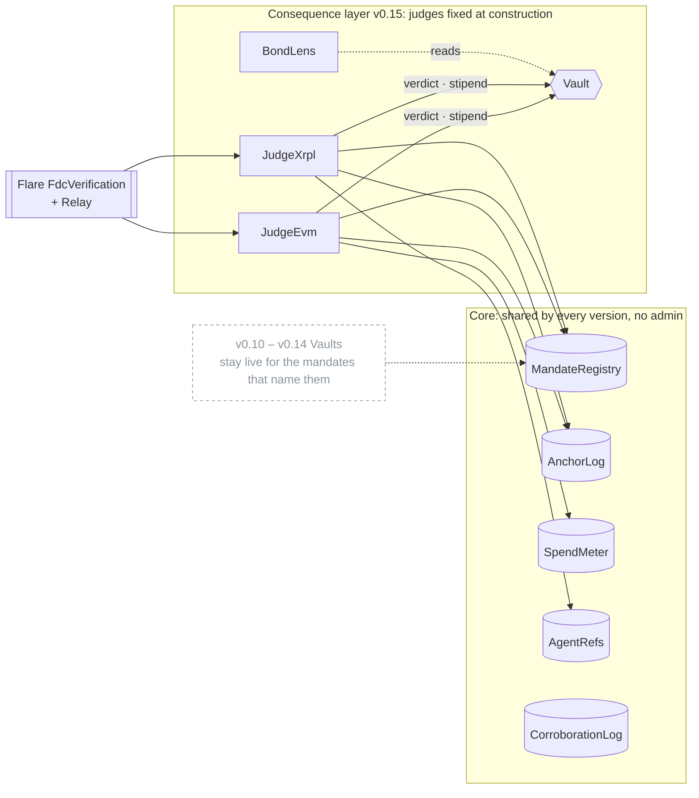

| Contract | Role | Address |
|---|---|---|
| `MandateRegistry` | Mandates, a delegation tree with monotonic narrowing, acknowledgement and revocation. No deployer, no admin key. | [`0x2c58fb05…263AA3`](https://coston2-explorer.flare.network/address/0x2c58fb0504377fef325DceB66219bC6302263AA3) |
| `AnchorLog` | Per-mandate sequence of Merkle roots over receipts (witness 1), with `leavesURI`. | [`0xF2b7A266…Fa40a8`](https://coston2-explorer.flare.network/address/0xF2b7A2668e7430611c9b225ea7c966E489Fa40a8) |
| `SpendMeter` | The running tally an effector reads before it acts, kept as `(timestamp, total)` checkpoints (SPEC §7.1). | [`0xa5e06ADc…576dE2`](https://coston2-explorer.flare.network/address/0xa5e06ADc76b96cc8c941B98FDA365f10a0576dE2) |
| `Vault` | Holds every wei: bonds, proceeds, stakes, watch pools. It runs the commit–reveal gate and `verdict`, which only its judges can call (§8.2). Each deposit compensates whom its depositor names (§8.3). The watch pool pays whoever paid for an attestation through `requestAttestation` (§8.4). | [`0xB15f5041…9a24aF`](https://coston2-explorer.flare.network/address/0xB15f5041F4aA2bc212832dfb0e59CD6c0e9a24aF) |
| `JudgeEvm` | §6.1 false payment, §6.2–6.3 overrun, §6.4 unanchored deed, §6.5 under-reported spend, §6.11 gross ERC-20 outflow on a docket. Holds no funds. | [`0x463042fb…4d42cFf2`](https://coston2-explorer.flare.network/address/0x463042fbFD04c723F430eC299aD4000D4d42cFf2) |
| `JudgeXrpl` | §6.8 overrun over receipted payments, one-shot or on a docket. §6.10 gross XRP outflow on a docket that outlives the verifier. Holds no funds. | [`0x9201272e…9d765940`](https://coston2-explorer.flare.network/address/0x9201272ee10B19177A04435195B3b29D9a765940) |
| `AgentRefs` | An XRPL account accepts a mandate (`prove`) or declares exclusivity (`proveExclusive`) with a memo. | [`0x6036B279…E0fca0`](https://coston2-explorer.flare.network/address/0x6036B279d6Fe4aB5DAcbea97162C5394B6E0fca0) |
| `CorroborationLog` | Records deeds whose two witnesses agreed, once per deed per agent. This is the data a public score needs. | [`0xf51c8241…56ed89`](https://coston2-explorer.flare.network/address/0xf51c82410ad01239a1e708aa5c4c68a25c56ed89) |
| `BondLens` | Stateless. Shows what a case would take before anyone pays for a single attestation. | [`0x960A0e68…89D3Bf3D`](https://coston2-explorer.flare.network/address/0x960A0e68863B0BABBa05Ae2025E6b7e289D3Bf3D) |

The Vaults of v0.14 [`0x9bF9e418…72566fE`](https://coston2-explorer.flare.network/address/0x9bF9e4186cFb569Fe5bf528e2859aA7B672566fE), v0.13 [`0x3e3316D2…5F55EE`](https://coston2-explorer.flare.network/address/0x3e3316D2Dd78d548DFBa2A777171F1E3e05F55EE), v0.12 [`0xFd09d395…93Ffae`](https://coston2-explorer.flare.network/address/0xFd09d39519F51Ccf12c57bd2D5cF8A71a593Ffae) and v0.11 [`0x40A149aC…AbDAAB`](https://coston2-explorer.flare.network/address/0x40A149aCdA2A3D2e299e0FaE4aAA695662AbDAAB), and the v0.10 `Bond` [`0x68004002…3cf65B`](https://coston2-explorer.flare.network/address/0x6800400225e03539c4B719f470cC2C8edC3cf65B), stay live for the mandates that name them. v0.13–v0.15 run with **production timers**: `commitLead` 10 min, `responseWindow` 24 h, `anchorGrace` 1 h, `meterGrace` 5 min. Every earlier deployment is listed in [docs/DEPLOYMENTS.md](docs/DEPLOYMENTS.md).

## How it got here

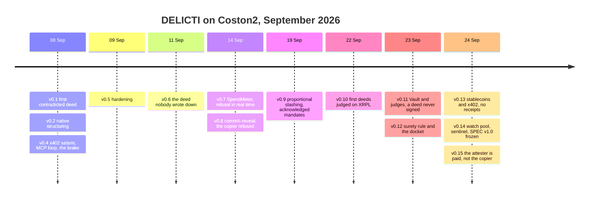

Each release, with the reasoning behind every decision (including the ones that went against the plan), is in [CHANGELOG.md](CHANGELOG.md).

## Who this is for

- **Teams giving agents wallets** (x402, MCP tools, trading agents, agentic payments) that need a spending limit that holds across calls, not only per call.
- **Anyone who underwrites or lends to an agent.** A counterparty can price a bond that has a public mandate, a proportional penalty and a record the agent cannot curate.
- **Watchers.** Anyone can bring a case. Attestation fees come back first, up to what the verdict takes, then 10 % of the rest. Commit–reveal keeps that reward from being front-run, and a watch pool pays for recording while the agent behaves.
- **Receipt, identity and reputation standards** (ERC-8004, KYA-OS, ACTA). DELICTI verdicts and the public score are inputs those standards can consume: reputation built from corroborated deeds rather than declarations.

## Limits, stated up front

> *"Currently I believe that no lab has solved alignment and monitoring to a sufficient degree to continue responsibly scaling at maximum speed for much longer."*
> — Jakub Pachocki, [*An Alien Mind*](https://openai.com/index/an-alien-mind/)

DELICTI does not monitor minds. It proves deeds and prices them, and it is honest about where that stops. Read §10 of the [SPEC](SPEC.md) first: *what DELICTI does not claim*. These are the limits a reader deciding whether to rely on it should see here:

- **SPEC v1.0 is frozen; the code is not audited.** The freeze binds the interface: the mandate, the leaf, kinds 1–8 and their encodings, and the consequence rules. It does not say the code is free of defects (SPEC §14).
- **Testnet only.** Everything runs on Coston2, the XRPL testnet and forks. Slither, a 300,000-call invariant campaign and internal adversarial reviews have run. The v0.10 review found two openings and the v0.14 review found the copier; each was fixed with regression tests before shipping. No independent audit has run.
- **Consequence is after the fact; prevention is optional.** FDC finality takes minutes. The brake refuses a dead or borrowed mandate and the slice that would break the budget, but only in effectors that choose to check.
- **Stablecoins only where the FDC looks.** §6.11 enforces ERC-20 budgets on Ethereum, Flare and Songbird. Base, where most x402 payments settle today, is not an FDC source, so nothing there can be proven.
- **On XRPL, DELICTI sees XRP, not issued currencies.** RLUSD and every other IOU are invisible to it.
- **XRPL proofs age out after ~14 days.** A docket carries a deed for ever once it is filed. A deed nobody files in time is lost to the case. The watch pool pays for filing only where a principal funded one.
- **Small bonds are hard to watch without a pool.** A verdict pays for proving a case only when 10 % of the bond exceeds the attestation fees, which are 20 FLR per request on mainnet.
- **Collusion between a principal and its own agent** can take the challenger's share of an outsider's deposit, and nothing more (§8.3).
- **Proportional up to the bond, not beyond.** Once the overrun equals the budget, further units cost nothing more. Only a larger bond moves that ceiling.
- **Deeds, not minds.** DELICTI proves what happened and whether it was permitted. It does not prove intent, alignment or reasoning.
- **Whitehat only.** Never run it against mainnet funds that are not yours.

## Roadmap

In order. Nothing below moves up until the item above it is live.

1. ~~**XRPL, live.**~~ Done in v0.10.
2. ~~**Every XRP outflow, not only payments.**~~ Done in v0.11. ~~Proofs that outlive the verifier~~: the docket, v0.12.
3. ~~**Stablecoins and x402 without receipts.**~~ Done in v0.13 (§6.11).
4. ~~**Paid watchers and a public score.**~~ Done in v0.14–v0.15: the watch pool, the sentinel, and the per-agent score (SPEC §8.4, §11.2).
5. **An independent audit**, then mainnet.
6. **Verdicts as native XRPL credentials** (XLS-70 / XLS-80), issued and deleted by a Protocol Managed Wallet under Flare Confidential Compute ([SPEC §13](SPEC.md#13-roadmap-delicti-verdicts-as-native-xrpl-credentials-specified-not-implemented)). This is specified, not implemented.
7. **A risk market** priced on those scores.

## FAQ

**How do I cap an AI agent's total spending, not just each payment?**
Commit a mandate with a budget in `MandateRegistry` and post a bond. Have the effector read `SpendMeter.wouldExceed` before each settlement. The meter refuses the slice that would break the budget. If an effector does not check, the sum of the FDC-attested deeds convicts after the fact.

**Can an agent be held accountable for x402 payments it only signed?**
Yes. Under §6.11 an exclusive agent answers for every `Transfer` of the mandate's token out of its address, including EIP-3009 settlements sent by a facilitator. No receipts are needed, and the proof is the token's own event log attested by the FDC.

**How do I prove what an AI agent did on the XRP Ledger?**
An FDC `BalanceDecreasingTransaction` attestation proves that an account's XRP balance fell in a given transaction, whatever the transaction type: payments, offers taken by others, escrow, AMM, fees. `JudgeXrpl.fileXrpOutflow` sums those proofs against the mandate (§6.10).

**Why Flare?**
Flare is the only chain with a cross-chain attestation protocol enshrined in consensus. The second witness is not an oracle this project runs. It is the network.

**Does it work with MCP and x402?**
Yes. [flario](https://github.com/dziuba0x/flario), an MCP server for Flare, is the first effector that speaks DELICTI. It binds `mandate_ref` into its `flario-receipt/2`. With `DELICTI_REGISTRY` set, it refuses a payment before funds move when the mandate is dead or does not belong to the payer.

**Who watches, and why would they?**
Anyone. The watcher who proves a breach gets its fees back plus 10 %. A principal can also fund a watch pool that pays per recorded deed while the agent behaves. The reference sentinel is open source, holds no privileges, and is `altruist` by policy.

**Is this a replacement for ERC-8004?**
No. ERC-8004 gives agents an identity and a place to record reputation. DELICTI produces the kind of evidence that reputation should be built from.

**Who judges?**
Nobody. A verdict is a transaction that checks FDC proofs against the Relay's Merkle root and applies a rule fixed in code. There are no jurors, no votes and no admin key. A Vault's judges are fixed when the Vault is deployed.

## Glossary

- **Mandate**: what a principal allows an agent to do, committed on-chain before the act. It holds a budget, a window, an asset key, a source chain, an optional XRPL `agentRef`, and the Vault that bonds it.
- **Effector**: the process that turns an agent's intent into an effect, such as an MCP tool server or an x402 facilitator. Its signed receipt is witness 1.
- **FDC**: the Flare Data Connector. Flare's validators attest to facts on other chains, and a Merkle proof against the Relay makes each fact usable on-chain. It is witness 2.
- **Exclusive**: the agent's promise that everything its key does in the window belongs to this mandate. It is the price of being judged without receipts (§6.4, §6.10, §6.11).
- **Docket**: a per-mandate record of deeds filed once while provable, counted for ever.
- **Watch pool**: principal-funded stipends per new deed recorded, paid to whoever paid for that deed's attestation.
- **Sentinel**: the reference watcher. It discovers, prices, files, convicts and scores.
- **Evidence classes**: **A** means two witnesses agree (receipt and FDC attestation). **B** means one witness, because the effect is not observable in the world (for example, an email sent). **C** means self-report only.

## Witness 1 from a real effector

```
x402 payload  →  flario checks MandateRegistry.isLive + agent  →  settles  →  x402_receipt{mandate_ref, fdc_attestation_ref}
tools/delicti.py normalize receipt.json   →  leaf + leafHash (== Receipts.hash on-chain)
tools/delicti.py tree leaf*.json          →  root for AnchorLog.anchor + per-leaf proofs for the judges
```

The effector is the final common pathway. A deed with no mandate is a muscle moving with no signal, so the effector may simply not move.

## Documents

- [SPEC.md](SPEC.md): **v1.0, frozen**. Vocabulary, trust model, challenges and their invariants, bond economics, the watch pool, non-claims, metrics, and the XRPL credentials roadmap.
- [CHANGELOG.md](CHANGELOG.md): every release, with the reasoning behind each decision.
- [docs/DEPLOYMENTS.md](docs/DEPLOYMENTS.md): every Coston2 deployment and live run since v0.1.
- [docs/research/watchers.md](docs/research/watchers.md): who watches and why they would, drawn from seven earlier systems.
- [sdk/README.md](sdk/README.md): the TypeScript SDK, the watchers and the sentinel.
- [docs/proposals/kya-os-mandate-ref.md](docs/proposals/kya-os-mandate-ref.md): `mandate_ref` as proposed to the receipt ecosystems.
- [llms.txt](llms.txt): a map of this repository for language models and agents.
- [SECURITY.md](SECURITY.md): how to report a vulnerability.

## Citing

If you use DELICTI in research, GitHub's *Cite this repository* button (built from [CITATION.cff](CITATION.cff)) gives BibTeX and APA.

## License

MIT, [Dziuba Technology](https://github.com/dziuba0x). Built in Warsaw, Poland.
