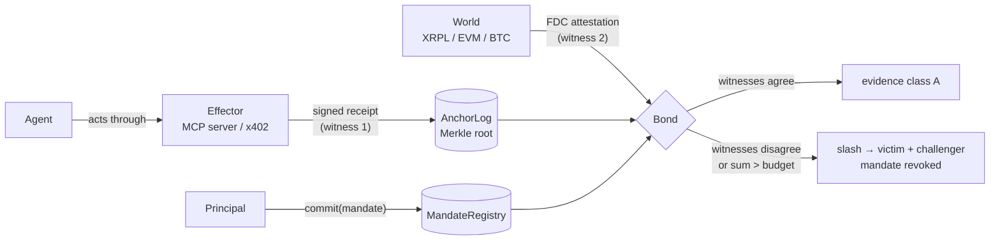

# DELICTI

[](https://github.com/dziuba0x/delicti/actions/workflows/test.yml)
[](LICENSE)


**Corpus delicti for AI agents.** Before anyone is judged, prove the deed happened.

DELICTI is a corroboration-and-consequence layer for the actions of autonomous AI agents, anchored on [Flare](https://flare.network). It does not define yet another receipt format. It takes the signed receipts that effectors already produce (KYA-OS / Checkpoint `_meta` proofs, ACTA / ASQAV receipts, flario `x402_receipt`s) and adds the four things none of them have:

1. **Mandate before act** — a principal commits, on-chain, what the agent may do (budget, window, delegation chain) *before* the episode. Children can only narrow parents.
2. **Two witnesses to the same overt act** — the effector's receipt is witness one; Flare's Data Connector (FDC) attesting the effect in the world is witness two. Agreement is evidence. Disagreement is a *contradicted deed*.
3. **Delta over the sequence** — violations are computed against the cumulative budget of the mandate, not per action, so structuring ("salami") is caught.
4. **A brake that can see the sequence** — the effector reads the mandate's cumulative tally before it acts, so the fifth slice of a salami is refused in milliseconds rather than slashed minutes later. An effector that skips the tally is choosing to be judged by the FDC instead.
5. **Consequence without a court** — a bond is slashed on proof, pattern lifted from FAssets' challenger role. Challenger gets 10%, the harmed party gets the rest.

> When a mind becomes alien, its words stop being evidence. Its deeds, confirmed independently, remain. — the thesis, after J. Pachocki's *An Alien Mind*.

## The loop



## Proven on Coston2 — click any of them

Nothing below is a claim about what the contracts would do. Each line is a transaction anyone can open.

| What was proven | Transaction |
|---|---|
| A receipt that lied: the agent's anchored receipt claims an XRPL payment, FDC `ReferencedPaymentNonexistence` proves it never happened → slash | [`0x91bb1909…5fdc91`](https://coston2-explorer.flare.network/tx/0x91bb190933e9e0d5abbc8efc2816ba26d475c2fa3cfbfb2636ae656e3c5fdc91) |
| Structuring, native: five 1-FLR deeds under a 4-FLR budget, each legal alone, each corroborated by FDC — the sum convicts | [`0xa547ebad…96557f`](https://coston2-explorer.flare.network/tx/0xa547ebada6b01953100ed2fad6abdead1b3122d3d280ad302040e69b3f96557f) |
| Structuring over x402: five genuine EIP-3009 settlements, genuine `flario-receipt/2`, FDC proofs carrying the `Transfer` event | [`0x19c73850…014ed1`](https://coston2-explorer.flare.network/tx/0x19c738500129ff4447802561a804b92620e47f3222fa70a76c6ad781ce014ed1) |
| The same loop driven through a **running flario MCP server** — witness 1 emitted by the effector process, not hand-built | [`0x118bc486…d922f0`](https://coston2-explorer.flare.network/tx/0x118bc48692b986875c2153492ff81757da9d9bf18e4201341cb2711f50d922f0) |
| The effector-side brake: a live mandate pays, while a missing, revoked or borrowed one is refused **before any funds move** | [`0x2b59d401…277664`](https://coston2-explorer.flare.network/tx/0x2b59d401f8819c24c8e6b89841f35b7df09a4282dd1b7607ad4db7505a277664) |
| The hardened v0.5 contracts, same loop again, proceeds now credited and pulled with `claim()` | [`0xc3ec3064…8c5fc4`](https://coston2-explorer.flare.network/tx/0xc3ec30648c7e9869cc101a0b58b041d8260103cf4f9b49f8645fe842a48c5fc4) |
| **Structuring refused while it was still happening** — four slices fit, the fifth was rejected by the meter with no FDC round and no transaction at all | [meter state, mandate #1](https://coston2-explorer.flare.network/address/0xD64465B95A1E83DC292AcB1e5b66dD416ADeA55C) |
| The effector recorded two settlements out of five; the FDC proved five, and the tally was convicted of the difference | [`0x53664b9f…0b20ff`](https://coston2-explorer.flare.network/tx/0x53664b9f186353821ae8be87e75279d0de6619fd3326f3751974a616fb0b20ff) |
| A deed with no receipt behind it: nobody answered, the window closed, the bond went | [`0x432ca347…72490b`](https://coston2-explorer.flare.network/tx/0x432ca347481f7a279e377b648c5ad2b776f871b38ed0068b515383d63e72490b) |
| The same accusation, answered in time with the anchored receipt — dismissed, and the accuser's stake forfeited | [`0x1bbcaf3f…6ae48b`](https://coston2-explorer.flare.network/tx/0x1bbcaf3f0a371facd17b8922d522e59917120f0055a2cca6954c3d38ba6ae48b) |

Every challenge type DELICTI defines has now been executed on Coston2, in both directions where it has two: an accusation that stands and one that is answered.

## Why signed receipts are not enough

| | KYA-OS / Checkpoint | ACTA / ASQAV | AP2 mandates | OAP (pre-action) | **DELICTI** |
|---|---|---|---|---|---|
| Effector-signed receipt | yes | gateway/operator | yes | gateway | consumes theirs |
| Commitment *before* the act | – | – | payments only | policy hash | on-chain, with budget + delegation tree |
| Independent confirmation the effect happened | – | – | – | – | **FDC (second witness)** |
| Detects structuring across many small calls | – | – | – | admitted gap | **sum over sequence** |
| Consequence without a court | – | – | – | – | **bonded slash** |
| Survives the operator's bankruptcy | if they keep logs | Bitcoin/Rekor anchor | – | – | neutral chain |

A receipt proves *registration*. "A false claim can be immutably registered." DELICTI proves the *deed* — or proves the receipt lied.

## Status

| Piece | State |
|---|---|
| `MandateRegistry.sol` — commitments, delegation tree, monotonic narrowing, revocation | tests pass |
| `AnchorLog.sol` — per-mandate sequence of Merkle roots over receipts; refuses dead mandates | tests pass |
| `Bond.sol` — `challengeFalsePayment`: anchored receipt × FDC `ReferencedPaymentNonexistence` → slash | tests pass (mock FDC); live `FdcVerification` resolution verified on a Coston2 fork |
| `Receipts.sol` — normalized "overt act" leaf bound to the original third-party receipt | done |
| `scripts/contradicted-deed.sh` — live end-to-end on Coston2: testXRP nonexistence → FDC proof → slash | **done, executed on Coston2** |
| flario `x402_receipt` v2 with `mandate_ref` + effector-side mandate gate (`DELICTI_REGISTRY`, `DELICTI_REQUIRE_MANDATE`) on both the MCP and the HTTP path | shipped in [flario](https://github.com/dziuba0x/flario) |
| `Bond.challengeBudgetOverrunERC20` — the real x402 case: settlement is `transferWithAuthorization` on the token, native value is 0, the deed is the `Transfer` event inside the FDC proof | tests pass |
| `tools/delicti.py` — normalize a flario receipt into a leaf (bit-identical to `Receipts.hash`), evidence class, sorted-pair Merkle tree + proofs | done |
| `scripts/x402-structuring.sh` — end-to-end with real EIP-3009 settlements, real flario v2 receipts, FDC proofs with events, ERC-20 challenge | **done, executed on Coston2** |
| `Bond.challengeBudgetOverrun` + `scripts/structuring.sh` — five 1-FLR deeds under a 4-FLR budget, each corroborated by FDC `EVMTransaction`, sum convicts | **done, executed on Coston2** |
| `scripts/mcp-structuring.sh` — the same salami, but every deed is a paid MCP call to a running flario server: witness 1 is emitted by the effector process, not hand-built | **done, executed on Coston2** |
| `scripts/brake-test.sh` — the effector-side brake (SPEC §7) live: a live mandate pays; a missing, revoked or borrowed mandate is refused before any funds move | **done, executed on Coston2** |
| `Bond.accuseUnanchoredDeed` / `answerAccusation` / `resolveAccusation` + `MandateRegistry.declareExclusive` — the deed nobody wrote down (SPEC §6.4) | **done, executed on Coston2** (both outcomes) |
| `SpendMeter.sol` + `Bond.challengeUnderReportedSpend` — the running tally that refuses structuring in real time (SPEC §7.1), and convicts the effector whose tally lied (§6.5) | **done, executed on Coston2** |
| `Bond.commitChallenge` — commit–reveal on all five challenges and on the accusation, so the 10 % belongs to whoever detected the violation rather than to whoever copied the calldata (SPEC §6.7) | tests pass (81); **not yet executed on Coston2** |

### v0.8 — commit–reveal (2026-09-14): written and tested, not yet on-chain

Every challenge must now be committed — a bare hash, leaking nothing — **before** the FDC voting round that produces its evidence begins, and the commitment expires an hour later. The reason is that a challenge cannot be assembled in secret: `FdcHub.requestAttestation` is an on-chain call carrying the deed's transaction hash in the clear, minutes before the reveal. Without this, a parasite watching `FdcHub` copies the finished calldata out of the mempool, outbids the gas, and collects the reward having paid for no monitoring at all — so the equilibrium number of real watchers is zero, and a consequence layer nobody watches is theatre. SPEC §6.7 has the rule and the reasoning for each of its clauses.

What is **not** claimed: none of this has been executed on Coston2. The unit tests cover the mechanism in both directions — including the copied-calldata regression on the flagship structuring path, the later-round variant that the obvious rule misses, and the stale pre-committed squat — and the voting-round clock is verified against live Coston2 on a fork. But no commitment, no refusal and no reveal exists on-chain yet, and this section will say so until it does. `scripts/structuring.sh` with `SNIPE=1` is what will produce the evidence: it leaves the copier's refusal on-chain as a reverted transaction next to the honest reveal.

Two things the audit turned up and this release does **not** fix, both now in SPEC §10 rather than glossed over: a squatter willing to pay rent on every candidate deed set forever can still hold a live commitment (the defence is economic, not cryptographic), and the agent — which has the earliest knowledge of its own violation by construction — can self-slash ahead of a real watcher.

### Live on Coston2 (2026-09-14) — v0.7, and the loop closed in both directions

Deployment: `MandateRegistry` [`0x3b53a646E5450F4b525e30F2aA59be95AF77657b`](https://coston2-explorer.flare.network/address/0x3b53a646E5450F4b525e30F2aA59be95AF77657b), `AnchorLog` [`0xd5EECFAFE96fE9eec7E126F4B318DB139c9396bf`](https://coston2-explorer.flare.network/address/0xd5EECFAFE96fE9eec7E126F4B318DB139c9396bf), `SpendMeter` [`0xD64465B95A1E83DC292AcB1e5b66dD416ADeA55C`](https://coston2-explorer.flare.network/address/0xD64465B95A1E83DC292AcB1e5b66dD416ADeA55C), `Bond` [`0x3557Ae63bC3868165E605685b45506116E2CE1e6`](https://coston2-explorer.flare.network/address/0x3557Ae63bC3868165E605685b45506116E2CE1e6) (testnet timers: `responseWindow` 600 s, `anchorGrace` 300 s; production values are 24 h and 1 h).

**Structuring refused in real time (mandate #1).** Four settlements of 0.01 C2FLR against a 0.04 budget, each preceded by a `wouldExceed` call and followed by `note`: [`0x5bcd06f8…4fd525`](https://coston2-explorer.flare.network/tx/0x5bcd06f80f49d73b21e0ac226e9efdbc2479e51cd56f715ef34e425e694fd525), [`0xc38c2a1d…191acb`](https://coston2-explorer.flare.network/tx/0xc38c2a1d23ccc6c37da148732d5c3da23b8f31b4273858440cffdc9e75191acb), [`0x10a8a73a…f9a61c`](https://coston2-explorer.flare.network/tx/0x10a8a73a3bb68c2d69c2e1b4d243bfbaf09c202189c3486a9ce9825bfcf9a61c), [`0xd5f59139…2d8351`](https://coston2-explorer.flare.network/tx/0xd5f59139c2b3a639af2c4bfafc3372e18d4a5d8864bc8d1332b63a34ff2d8351). The meter then reads `spent = 0.04`, `headroom = 0`, `wouldExceed = true`. **The fifth slice has no transaction hash, because it never happened** — the refusal is an `eth_call`, so there is nothing to link to but the meter itself. That is the point of this one: no FDC round, no waiting, no funds moved, and the bond untouched (`slashed = false`). Script: `scripts/spend-meter.sh` (`MODE=brake`).

**The tally that lied (mandate #2).** The effector recorded two of five settlements and stayed silent about three; the meter said 0.02 while the world showed 0.05. Five FDC `EVMTransaction` proofs, no anchored leaves needed — `challengeUnderReportedSpend`: [`0x53664b9f…0b20ff`](https://coston2-explorer.flare.network/tx/0x53664b9f186353821ae8be87e75279d0de6619fd3326f3751974a616fb0b20ff) (280,836 gas) → slashed. Script: `scripts/spend-meter.sh` (`MODE=underreport`).

**The deed nobody wrote down (mandate #5).** A deed from an exclusive agent's address with no receipt behind it, accused after the anchor grace: [`0x3ea01514…e27772`](https://coston2-explorer.flare.network/tx/0x3ea01514d173db33ddc557315b0d7b54f6a907e49bff866d08265ce136e27772) (221,524 gas). Nobody answered, the response window closed, and anyone could resolve it — [`0x432ca347…72490b`](https://coston2-explorer.flare.network/tx/0x432ca347481f7a279e377b648c5ad2b776f871b38ed0068b515383d63e72490b) (118,872 gas) → slashed, mandate revoked, the challenger's 10 % and stake credited for pull. Script: `scripts/unanchored-deed.sh` (`MODE=silence`).

**The same accusation, answered (mandate #4).** The agent had anchored the receipt in time, so the accusation was dismissed on the evidence and the accuser's stake was forfeited to the principal: accusation [`0x8f0a4d3c…8a99ec`](https://coston2-explorer.flare.network/tx/0x8f0a4d3c830c72018d9f49f1581778856b53b07c7e27e289956a17cedf8a99ec) (220,684 gas), answer [`0x1bbcaf3f…6ae48b`](https://coston2-explorer.flare.network/tx/0x1bbcaf3f0a371facd17b8922d522e59917120f0055a2cca6954c3d38ba6ae48b) (76,075 gas), `slashed = false`. Script: `scripts/unanchored-deed.sh` (`MODE=answer`).

### Coston2 (2026-09-11) — v0.6 deployed, accusation loop not yet demonstrated

`MandateRegistry` [`0x401C07e28db3464ab2013C36Babf4701cD8dC6bd`](https://coston2-explorer.flare.network/address/0x401C07e28db3464ab2013C36Babf4701cD8dC6bd), `AnchorLog` [`0x2FbcF31FC3a66BbfbA30743aab932d7AE78FDf56`](https://coston2-explorer.flare.network/address/0x2FbcF31FC3a66BbfbA30743aab932d7AE78FDf56), `Bond` [`0xc42A87F8E005B231819b16E46B119b90228b86A6`](https://coston2-explorer.flare.network/address/0xc42A87F8E005B231819b16E46B119b90228b86A6). Testnet timers: `responseWindow = 600 s`, `anchorGrace = 300 s` (production values are 24 h and 1 h — both are constructor immutables so the whole loop can be shown in one sitting).

What is **not** claimed yet: no accusation has been resolved on-chain. `scripts/unanchored-deed.sh` reached the FDC step and the data-availability layer kept answering `attestation request not found` for the deed's voting round, far past the 2–4 minutes these rounds usually take, with Coston2 gas at 1500–2000 gwei instead of the usual ~25. The contracts are covered by 42 tests; the live demonstration is pending, and this section will say so until it is not.

### Live on Coston2 (2026-09-09) — v0.5 hardening

**The same loop, against the hardened deployment (mandate #1).** Five paid MCP calls through the flario server, five FDC proofs with `Transfer` events, `challengeBudgetOverrunERC20`: [`0xc3ec3064…8c5fc4`](https://coston2-explorer.flare.network/tx/0xc3ec30648c7e9869cc101a0b58b041d8260103cf4f9b49f8645fe842a48c5fc4) (361,940 gas) → slashed. The proceeds are now credited, not pushed: `claim()` [`0x45885501…8a0bf3`](https://coston2-explorer.flare.network/tx/0x458855019abfa0511329e3e5891febdeae9e0d940b51266a28dde129008a0bf3). Deployment: `MandateRegistry` [`0x1e85be1CD6D499f5E8AE12C6Fa1336949188FbB7`](https://coston2-explorer.flare.network/address/0x1e85be1CD6D499f5E8AE12C6Fa1336949188FbB7), `AnchorLog` [`0x14E65D83032b85241B764f5fbbEE532a90403D23`](https://coston2-explorer.flare.network/address/0x14E65D83032b85241B764f5fbbEE532a90403D23), `Bond` [`0x9bDFE9C95980E7676E64779Cabe1948Ce6F04ae8`](https://coston2-explorer.flare.network/address/0x9bDFE9C95980E7676E64779Cabe1948Ce6F04ae8).

**The hardening, verified on-chain rather than only in tests.** `revoke()` followed immediately by `withdraw()` reverts `CoolingWindow()` (`0x3f93322d`) and the bond stays posted; `revokeByBond` from an address that is not the registered Bond reverts `NotBond()` (`0x799e4159`). CHANGELOG v0.5.0 says what each of those was protecting against.

### Live on Coston2 (2026-09-09)

**The loop through a running effector (mandate #8).** Every deed here is a paid MCP tool call: the agent is an MCP client, the flario server is the effector, it settles the EIP-3009 authorization itself and answers with its own `flario-receipt/2` carrying `mandate_ref`. Nothing about witness 1 is hand-built. Five calls of 1 mUSDT0 under a 4 mUSDT0 mandate, each corroborated by an FDC `EVMTransaction` proof carrying its `Transfer` event — `challengeBudgetOverrunERC20`: [`0x118bc486…d922f0`](https://coston2-explorer.flare.network/tx/0x118bc48692b986875c2153492ff81757da9d9bf18e4201341cb2711f50d922f0) (327,144 gas) → slashed, mandate revoked. Script: `scripts/mcp-structuring.sh`.

**The brake (SPEC §7), live.** Four calls against the same server: a live mandate with the correct agent pays ([`0x2b59d401…277664`](https://coston2-explorer.flare.network/tx/0x2b59d401f8819c24c8e6b89841f35b7df09a4282dd1b7607ad4db7505a277664), mandate #5); a call with no `mandate_id` under `DELICTI_REQUIRE_MANDATE=1`, a call under revoked mandate #6, and a call under mandate #7 belonging to another address are all refused **before any funds move** — the payer's token balance is unchanged across all three. Script: `scripts/brake-test.sh`.

### Live on Coston2 (2026-09-08)

**The real x402 salami (v0.3 deployment, mandate #3):** five genuine EIP-3009 `transferWithAuthorization` settlements of 1 mUSDT0 each (agent signs typed data, facilitator submits — exactly flario's x402 path), each wrapped in a genuine `flario-receipt/2` carrying `mandate_ref` (witness 1), each corroborated by an FDC `EVMTransaction` proof carrying the `Transfer` event (witness 2), under a 4 mUSDT0 mandate — `challengeBudgetOverrunERC20`: [`0x19c73850…014ed1`](https://coston2-explorer.flare.network/tx/0x19c738500129ff4447802561a804b92620e47f3222fa70a76c6ad781ce014ed1) (325,410 gas) → slashed, mandate revoked. Script: `scripts/x402-structuring.sh`. Deployment: `MandateRegistry` [`0x73109d769878cA2Cf0Ba180CF4f1a24b404F3f48`](https://coston2-explorer.flare.network/address/0x73109d769878cA2Cf0Ba180CF4f1a24b404F3f48), `AnchorLog` [`0x8eC9C70f9615804259c16e811dC428Db7a1522Fe`](https://coston2-explorer.flare.network/address/0x8eC9C70f9615804259c16e811dC428Db7a1522Fe), `Bond` [`0xBA146240AC394E64ca50CaC40100A2cdAE241e4e`](https://coston2-explorer.flare.network/address/0xBA146240AC394E64ca50CaC40100A2cdAE241e4e), `MockUSDT0` (EIP-3009, public mint) [`0x9Eea43feA502609d0D88DAfd1d64B4e929BF18C2`](https://coston2-explorer.flare.network/address/0x9Eea43feA502609d0D88DAfd1d64B4e929BF18C2).


Current deployment (v0.2, `Receipts.Leaf.ref`): `MandateRegistry` [`0x52A61f0B9312042c514B0aC5C053747B0EdF0C17`](https://coston2-explorer.flare.network/address/0x52A61f0B9312042c514B0aC5C053747B0EdF0C17), `AnchorLog` [`0x10F4e4bc90d483B9E1D6c90EE6d6275FF825D2ae`](https://coston2-explorer.flare.network/address/0x10F4e4bc90d483B9E1D6c90EE6d6275FF825D2ae), `Bond` [`0x84Da6082Ba9f453d6aE59A0A3f868F6A1C35046E`](https://coston2-explorer.flare.network/address/0x84Da6082Ba9f453d6aE59A0A3f868F6A1C35046E).

**Structuring proven (mandate #4):** five transfers of 1 C2FLR to `0x2222…2222` under a 4 C2FLR budget — each one legal alone, each corroborated by its own FDC `EVMTransaction` proof (rounds 1448936–1448937, `sourceAddress` == the mandated agent) — then `challengeBudgetOverrun` with all five: [`0xa547ebad…96557f`](https://coston2-explorer.flare.network/tx/0xa547ebada6b01953100ed2fad6abdead1b3122d3d280ad302040e69b3f96557f) (291,855 gas) → slashed, mandate revoked. This is the pattern pre-action gates cannot see, because every call passes on its own.

**First contradicted deed (v0.1 deployment):** `MandateRegistry` [`0x307cF47DB74a48CFC9813c59F29B1a2c546746d5`](https://coston2-explorer.flare.network/address/0x307cF47DB74a48CFC9813c59F29B1a2c546746d5), `AnchorLog` [`0xed65258EC80fAE6b780215aA17E1AB7A321d41E8`](https://coston2-explorer.flare.network/address/0xed65258EC80fAE6b780215aA17E1AB7A321d41E8), `Bond` [`0x6b4Dc7E1F6eda9B8D2ECa97dDF35e1E19A3E1ed2`](https://coston2-explorer.flare.network/address/0x6b4Dc7E1F6eda9B8D2ECa97dDF35e1E19A3E1ed2).

- FDC request (`ReferencedPaymentNonexistence`, testXRP, round 1448919): [`0x2fb195a3…60d13e`](https://coston2-explorer.flare.network/tx/0x2fb195a324e9eb4cf518e6cb88a234ec037e03be274ea6ec7d17a5b20460d13e)
- mandate #1 committed: [`0x8e6bae06…393c92`](https://coston2-explorer.flare.network/tx/0x8e6bae06d25aa959a73080a7902ffc34aa1c0be7284e66168df8295f65393c92); false receipt anchored: [`0x43c8bd62…f95ace`](https://coston2-explorer.flare.network/tx/0x43c8bd629abdb551cfaeee84906546fd21170f0b89b3ba1c4ae352f500f95ace); bond 1 C2FLR: [`0x0bc4f479…62181b`](https://coston2-explorer.flare.network/tx/0x0bc4f479decb87abdac5059c93f6527d2cfe2251030db69845db91140662181b)
- **challenge with the real FDC proof → slashed, mandate revoked**: [`0x91bb1909…5fdc91`](https://coston2-explorer.flare.network/tx/0x91bb190933e9e0d5abbc8efc2816ba26d475c2fa3cfbfb2636ae656e3c5fdc91) (159,787 gas)

Verified on Coston2 (chain 114): `FdcVerification` [`0x906507E0B64bcD494Db73bd0459d1C667e14B933`](https://coston2-explorer.flare.network/address/0x906507E0B64bcD494Db73bd0459d1C667e14B933), `Relay` [`0xa10B672D1c62e5457b17af63d4302add6A99d7dE`](https://coston2-explorer.flare.network/address/0xa10B672D1c62e5457b17af63d4302add6A99d7dE), FDC protocol id `200`.

## Release notes

See [CHANGELOG.md](CHANGELOG.md). Proposal to the receipt ecosystems: [docs/proposals/kya-os-mandate-ref.md](docs/proposals/kya-os-mandate-ref.md).

## Specification

The vocabulary, trust model, evidence classes, challenge invariants, and non-claims are fixed in [SPEC.md](SPEC.md) (v0.1 draft).

## Build & test

```bash
npm install                      # pulls @flarenetwork/flare-periphery-contracts
forge build
forge test                       # unit tests with a mock FDC
forge test --fork-url coston2 --match-contract Coston2ForkTest -vv   # live wiring
```

Deploy to Coston2: `forge script script/Deploy.s.sol --rpc-url coston2 --broadcast --private-key $PK`

## Witness 1 from a real effector

flario (an MCP server for Flare) is the first effector that speaks DELICTI. The paying agent adds `mandate_id` (and optionally `mandate_registry`) to its x402 payload; the server binds it into the receipt (`flario-receipt/2`, field `mandate_ref`) and, if `DELICTI_REGISTRY` is set, **refuses the payment before funds move** when the mandate is not live or the payer is not the mandated agent. The effector is the final common pathway — a deed with no mandate is a muscle moving with no signal, so the effector may simply not move.

```
x402 payload  →  flario checks MandateRegistry.isLive + agent  →  settles  →  x402_receipt{mandate_ref, fdc_attestation_ref}
tools/delicti.py normalize receipt.json   →  leaf + leafHash (== Receipts.hash on-chain)
tools/delicti.py tree leaf*.json          →  root for AnchorLog.anchor + per-leaf proofs for Bond
```

## Evidence classes

DELICTI names what it can and cannot prove:

- **A** — two witnesses agree (receipt + FDC attestation of the effect).
- **B** — one witness; the effect is not observable in the world (e.g. an email sent).
- **C** — self-report only.

## Threat model, honestly

- A compromised effector can sign false receipts. That is exactly why witness two exists: FDC does not trust the effector.
- FDC finality is minutes, not seconds. DELICTI is evidence after the fact, not a real-time brake (a mandate check hook is left in the spec for effectors that want one).
- Web2 effects need allow-listed sources on FDC; Sprint 0 corroborates on-chain and XRPL/BTC/DOGE effects only.
- Whitehat only. Everything runs on Coston2 / forks. Never real mainnet with other people's funds.

## License

MIT — Dziuba Technology.
