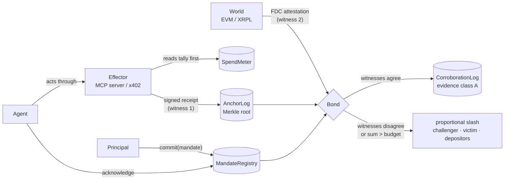

<div align="center">

# DELICTI

**Accountability for autonomous AI agents: a mandate before the act, an independent witness to the deed, and a bond that pays for the breach — without a court.**

[](https://github.com/dziuba0x/delicti/actions/workflows/test.yml)
[](https://github.com/dziuba0x/delicti/releases)
-2ea44f)


[](LICENSE)

[How it works](#how-it-works) · [Proven on-chain](#proven-on-chain--click-any-of-them) · [Quickstart](#quickstart) · [Contracts](#contracts-v09-on-coston2) · [Limits](#limits-stated-up-front) · [SPEC](SPEC.md) · [Changelog](CHANGELOG.md)

</div>

---

An AI agent with a wallet can be told *"spend at most 4 FLR"* and then spend 1 FLR five times. Every call passes a per-action policy check. Every call gets a signed receipt. The receipts are all true, and the mandate was still broken.

DELICTI is the layer that catches this and makes it cost something. It runs on [Flare](https://flare.network), because Flare's **Data Connector (FDC)** can attest, from consensus, what actually happened on another chain — EVM or XRPL — without trusting the agent, its operator, or its tool server.

> When a mind becomes alien, its words stop being evidence. Its deeds, confirmed independently, remain. — the thesis, after J. Pachocki's *An Alien Mind*.

## How it works

DELICTI does not define another receipt format. It takes the signed receipts effectors already produce (flario `x402_receipt`, KYA-OS / Checkpoint `_meta` proofs, ACTA / ASQAV receipts) and adds the five things none of them have:

1. **Mandate before act.** A principal commits on-chain what the agent may do — budget, time window, the asset and chain the budget is counted in, a delegation tree where children can only narrow parents — and **the agent acknowledges it** before any bond is accepted.
2. **Two witnesses to the same deed.** The effector's receipt is witness one. An FDC attestation of the effect in the world is witness two. Agreement is evidence; disagreement is a *contradicted deed*.
3. **The sum, not the slice.** Violations are computed against the mandate's cumulative budget, so structuring ("salami") is caught even when every single action was allowed.
4. **A brake that sees the sequence.** A DELICTI-aware effector reads the running tally before it acts and refuses the fifth slice in one `eth_call` — milliseconds, no funds moved. An effector that skips the check is choosing to be judged by the FDC instead, minutes later.
5. **Consequence without a court.** On proof, the bond is slashed **in proportion to the breach** (a 25 % overrun takes 25 %, floor 10 %). The challenger is reimbursed its attestation fees, read live from Flare, and earns 10 % of the rest; the harmed party gets the remainder; depositors take back what is left, pro rata.



## Why signed receipts are not enough

| | KYA-OS / Checkpoint | ACTA / ASQAV | AP2 mandates | OAP (pre-action) | Arbiter escrow (Kleros / UMA / LLM juries) | **DELICTI** |
|---|---|---|---|---|---|---|
| Effector-signed receipt | yes | gateway / operator | yes | gateway | – | consumes theirs |
| Commitment *before* the act | – | – | payments only | policy hash | deal terms | on-chain: budget, window, asset, delegation tree |
| Independent confirmation the effect happened | – | – | – | – | a judge decides | **FDC, from consensus** |
| Detects structuring across many small calls | – | – | – | admitted gap | – | **sum over the sequence** |
| Consequence | – | – | – | – | after a ruling | **on proof, proportional** |
| Survives the operator's bankruptcy | if they keep logs | Bitcoin / Rekor anchor | – | – | yes | neutral chain |

A receipt proves *registration* — "a false claim can be immutably registered". A court proves that someone was persuaded. DELICTI proves the *deed*, or proves the receipt lied.

## Proven on-chain — click any of them

Nothing below is a claim about what the contracts *would* do. Each line is a transaction on Flare's Coston2 testnet that anyone can open. The full record, with every deployment since v0.1, is in [docs/DEPLOYMENTS.md](docs/DEPLOYMENTS.md).

| What was proven | Transaction |
|---|---|
| **v0.14: the sentinel ran the protocol alone.** It discovered every mandate from state and read the XRPL accounts' histories through the FDC verifier's own index. It found outflows no one had filed, including an exclusivity statement's own fee, and convicted again. It caught an agent that had declared two overlapping exclusive mandates over one token, and was paid from a watch pool for keeping an honest docket, then again for the conviction | [`0x7a83ce5f…9001be`](https://coston2-explorer.flare.network/tx/0x7a83ce5fd73e185d63e95d4f3a432c8dc2528afd05aa4ab61a3580e9609001be) · stipends: [`0x950d5acb…d93583`](https://coston2-explorer.flare.network/tx/0x950d5acb7f8afe6ed8122bdcee2369d7e22f09c047a4ce6ff527bdb05cd93583) · [report](docs/sentinel/coston2-2026-09-24.html) |
| **The watcher bot convicted an agent on its own.** `delicti-watch` (SDK) found five x402 payments through the explorer. It filed the first three as a recording, then committed before any attestation existed, waited out the lead, proved the last two and filed the conviction. Nobody ran a script against this mandate | [`0x4735cd57…232bff`](https://coston2-explorer.flare.network/tx/0x4735cd5750935eeae918b7e477d0d90d977057132952192d007e628c22232bff) · recording: [`0xf93cd783…d6f077`](https://coston2-explorer.flare.network/tx/0xf93cd783087f95df0c30eb2f015afe527727917805490fdf12c85e72c6d6f077) |
| **v0.13 — a stablecoin agent convicted from the token's own log.** Five x402 settlements of 1 mUSDT0: the agent only *signed* them (EIP-3009), a facilitator *sent* them, and there are no receipts. FDC `EVMTransaction` proofs of the `Transfer` logs were filed on a docket, three uncommitted and then the committed crossing: 5 against a 4-unit budget took 25 % of the bond (SPEC §6.11) | [`0x75d51613…071dea`](https://coston2-explorer.flare.network/tx/0x75d51613fed7a4d69fc84fce28654cfdc43e91cccfdf557a3a60326506071dea) · docket: [`0x122d1f14…23ca2c`](https://coston2-explorer.flare.network/tx/0x122d1f142a75d9ef15eea39cfbaff77fa68fb678ddb35f3a552e30f72723ca2c) |
| **v0.10 — structuring on XRPL, live.** Five payments of 1 XRP under a 4-XRP budget, each proven by an FDC `Payment` attestation, each matched to an anchored receipt; the agent's XRPL account confirmed the mandate itself, by a payment carrying the mandate's challenge in its memo. A 25 % overrun took 25 % of the bond | [`0xb6856090…62bcb89`](https://coston2-explorer.flare.network/tx/0xb6856090222fb3083d425bb22126f88fd35e66f14641a8b03c2cd2c4862bcb89) · control: [`0xa5c17d21…63cd8f`](https://coston2-explorer.flare.network/tx/0xa5c17d21eb4c5495ab58282921e98b0360977a729a00bdb31dfdb66f6b63cd8f) |
| **An XRPL deed that is not a payment, done inside someone else's transaction** — the agent's resting offer was taken by another account; FDC `BalanceDecreasingTransaction` attests that the agent's account lost 9 XRP in *that* transaction, and `FdcVerification` accepts the proof (SPEC §6.9) | request [`0xc5a32b7b…067b47`](https://coston2-explorer.flare.network/tx/0xc5a32b7b53d626a630e84108500878a5f1f850dd67feda46d0d3ce672e067b47) |
| **v0.9 — proportional: a 25 % overrun took 25 % of the bond, not all of it**; asset and source read from the mandate, agent acknowledged | [`0x7c4c3094…8d8123`](https://coston2-explorer.flare.network/tx/0x7c4c3094585a4a1b5f473415d5cc39146a1b38def01b03030f65e3af5d8d8123) |
| A copier that lifted a finished challenge out of the mempool — refused on-chain, because it had not committed in time | [`0xab529327…4da115`](https://coston2-explorer.flare.network/tx/0xab52932730be8db7a8da1ec37396e5124f2033ec0e92f0baf98388c5464da115) *(reverted, `CommittedTooLate`)* |
| …and the same calldata, revealed two blocks later by the address that committed first | [`0xdbf70a53…9a7628`](https://coston2-explorer.flare.network/tx/0xdbf70a53b738e793b558b9f09a412f1727ec3c49a8899cd6f6700ab7fa9a7628) |
| **Structuring refused while it was still happening** — four slices fit, the fifth was rejected by the meter with no FDC round and no transaction at all | [meter state, mandate #1](https://coston2-explorer.flare.network/address/0xD64465B95A1E83DC292AcB1e5b66dD416ADeA55C) |
| The effector recorded two settlements out of five; the FDC proved five, and the tally was convicted of the difference | [`0x53664b9f…0b20ff`](https://coston2-explorer.flare.network/tx/0x53664b9f186353821ae8be87e75279d0de6619fd3326f3751974a616fb0b20ff) |
| A deed with no receipt behind it: nobody answered, the window closed, the bond went | [`0x432ca347…72490b`](https://coston2-explorer.flare.network/tx/0x432ca347481f7a279e377b648c5ad2b776f871b38ed0068b515383d63e72490b) |
| The same accusation, answered in time with the anchored receipt — dismissed, and the accuser's stake forfeited | [`0x1bbcaf3f…6ae48b`](https://coston2-explorer.flare.network/tx/0x1bbcaf3f0a371facd17b8922d522e59917120f0055a2cca6954c3d38ba6ae48b) |
| The effector-side brake: a live mandate pays, while a missing, revoked or borrowed one is refused **before any funds move** | [`0x2b59d401…277664`](https://coston2-explorer.flare.network/tx/0x2b59d401f8819c24c8e6b89841f35b7df09a4282dd1b7607ad4db7505a277664) |
| The loop driven through a **running flario MCP server** — witness 1 emitted by the effector process, not hand-built | [`0x118bc486…d922f0`](https://coston2-explorer.flare.network/tx/0x118bc48692b986875c2153492ff81757da9d9bf18e4201341cb2711f50d922f0) |
| Structuring over x402: five genuine EIP-3009 settlements, genuine `flario-receipt/2`, FDC proofs carrying the `Transfer` event | [`0x19c73850…014ed1`](https://coston2-explorer.flare.network/tx/0x19c738500129ff4447802561a804b92620e47f3222fa70a76c6ad781ce014ed1) |
| Structuring, native: five 1-FLR deeds under a 4-FLR budget, each legal alone, each corroborated by FDC — the sum convicts | [`0xa547ebad…96557f`](https://coston2-explorer.flare.network/tx/0xa547ebada6b01953100ed2fad6abdead1b3122d3d280ad302040e69b3f96557f) |
| A receipt that lied: it claims an XRPL payment, FDC `ReferencedPaymentNonexistence` proves it never happened → slash | [`0x91bb1909…5fdc91`](https://coston2-explorer.flare.network/tx/0x91bb190933e9e0d5abbc8efc2816ba26d475c2fa3cfbfb2636ae656e3c5fdc91) |

Every challenge type DELICTI defines has now been executed on Coston2 at least once, in both directions where it has two. What has **not** run live is stated as plainly: on the v0.10 deployment only the XRPL path has been exercised, so the audit fixes of v0.10 (the tally judged as of the deed, one corroboration per deed per agent) are covered by `test/Audit.t.sol`, not by a transaction; `CorroborationLog` has never recorded a live deed.

## Quickstart

Requires [Foundry](https://book.getfoundry.sh/getting-started/installation) and Node 22.

```bash
git clone https://github.com/dziuba0x/delicti && cd delicti
npm ci                           # @flarenetwork/flare-periphery-contracts, OpenZeppelin
forge build
forge test                       # 146 tests with a mock FDC, 12 of them invariants (~30 s)
```

Longer runs:

```bash
FOUNDRY_INVARIANT_RUNS=1500 FOUNDRY_INVARIANT_DEPTH=200 \
  forge test --match-contract Invariants                          # the long campaign (~10 min)
forge test --fork-url coston2 --match-contract Coston2ForkTest -vv  # live Flare wiring
```

Replay a live case against the v0.11 deployment (needs `cast`, `curl`, `python3`; the XRPL run also `pip install xrpl-py`):

```bash
cp .env.example .env             # throwaway key + Flare's public testnet verifier; v0.11 addresses prefilled
scripts/structuring.sh           # five deeds, commit, FDC proofs, proportional slash, copier refused (~10 min)
scripts/xrpl-structuring.sh      # the same on XRPL: faucet accounts, AgentRefs proof, five Payment proofs (~15 min)
scripts/xrpl-outflow.sh          # §6.10: no receipts, an offer eaten by someone else, four BDT proofs (~15 min)
```

`xrpl-structuring.sh` writes its state to `.run/` after every step that costs something; `RESUME=1` picks a stalled run up at the attestations and re-commits if the old commitment has aged out.

Or deploy your own: `forge script script/Deploy.s.sol --rpc-url coston2 --broadcast --private-key $PRIVATE_KEY`, then point `REG` / `LOG` / `METER` / `BOND` in `.env` at it.

The scripts in [`scripts/`](scripts) each reproduce one row of the table above: `structuring.sh`, `xrpl-structuring.sh`, `x402-structuring.sh`, `mcp-structuring.sh`, `brake-test.sh`, `spend-meter.sh`, `unanchored-deed.sh`, `contradicted-deed.sh`, `xrpl-outflow.sh`, `erc20-outflow.sh`. Test funds: [Coston2 faucet](https://faucet.flare.network/coston2).

## SDK, watchers and the sentinel

[`sdk/`](sdk) is a TypeScript package on viem. `Delicti` covers commit, exclusivity, bonds, the watch pool and status, each in one call. The watchers:

- `delicti-watch erc20 <id>`: stablecoins on Flare (§6.11).
- `delicti-watch xrpl <id>`: XRP outflow (§6.10). It reads the account's history the way the FDC will, by walking the AccountRoot's `PreviousTxnID` chain through the FDC verifier's own index.
- `delicti-watch sentinel`: every mandate at once. It discovers them from state, prices each case, acts according to its policy, and publishes a per-agent **public score** (SPEC §11.2).

Security needs one honest watcher, and anyone can run one. The design behind it is in [docs/research/watchers.md](docs/research/watchers.md): what Lightning watchtowers, Forta, keeper networks, UMA, rollup challengers and liquidation bots learned the hard way. See [sdk/README.md](sdk/README.md).

## Contracts (v0.14 on Coston2)

| Contract | Role | Address |
|---|---|---|
| `MandateRegistry` | mandates, delegation tree with monotonic narrowing, acknowledgement, revocation. No deployer, no admin key. | [`0x2c58fb05…263AA3`](https://coston2-explorer.flare.network/address/0x2c58fb0504377fef325DceB66219bC6302263AA3) |
| `AnchorLog` | per-mandate sequence of Merkle roots over receipts (witness 1), with `leavesURI` | [`0xF2b7A266…Fa40a8`](https://coston2-explorer.flare.network/address/0xF2b7A2668e7430611c9b225ea7c966E489Fa40a8) |
| `SpendMeter` | the running tally an effector reads before it acts, kept as `(timestamp, total)` checkpoints (SPEC §7.1) | [`0xa5e06ADc…576dE2`](https://coston2-explorer.flare.network/address/0xa5e06ADc76b96cc8c941B98FDA365f10a0576dE2) |
| `Vault` | every wei: bonds, proceeds, stakes; the commit–reveal gate; `verdict`, callable only by its judges (§8.2); each deposit compensates whom its depositor names (§8.3); the watch pool pays whoever keeps a docket (§8.4) | [`0x9bF9e418…72566fE`](https://coston2-explorer.flare.network/address/0x9bF9e4186cFb569Fe5bf528e2859aA7B672566fE) |
| `JudgeEvm` | §6.1 false payment, §6.2–6.3 overrun, §6.4 unanchored deed, §6.5 under-reported spend, §6.11 gross ERC-20 outflow on a docket. No funds. | [`0x361730A0…d29a2C36`](https://coston2-explorer.flare.network/address/0x361730A0D1e5886DfF3f7Ea4fC38832Ed29a2C36) |
| `JudgeXrpl` | §6.8 overrun over receipted payments (kind-3 and kind-4 receipts, one-shot or on a docket), §6.10 gross XRP outflow on a docket that outlives the verifier. No funds. | [`0xE9E6eD9E…4a14E688`](https://coston2-explorer.flare.network/address/0xE9E6eD9E3ca7d005a37568E18A80226B4a14E688) |
| `AgentRefs` | an XRPL account accepts a mandate (`prove`) or declares exclusivity (`proveExclusive`) with a memo | [`0x6036B279…E0fca0`](https://coston2-explorer.flare.network/address/0x6036B279d6Fe4aB5DAcbea97162C5394B6E0fca0) |
| `CorroborationLog` | records deeds whose two witnesses agreed, once per deed per agent — the data a public score needs | [`0xf51c8241…56ed89`](https://coston2-explorer.flare.network/address/0xf51c82410ad01239a1e708aa5c4c68a25c56ed89) |
| `BondLens` | stateless: what a case would take, before paying for a single attestation | [`0xA73f7403…5500BE1b`](https://coston2-explorer.flare.network/address/0xA73f740302FCFE27880EbDd3be3B77FF5500BE1b) |

The v0.13 Vault [`0x3e3316D2…5F55EE`](https://coston2-explorer.flare.network/address/0x3e3316D2Dd78d548DFBa2A777171F1E3e05F55EE), the v0.12 Vault [`0xFd09d395…93Ffae`](https://coston2-explorer.flare.network/address/0xFd09d39519F51Ccf12c57bd2D5cF8A71a593Ffae), the v0.11 Vault [`0x40A149aC…AbDAAB`](https://coston2-explorer.flare.network/address/0x40A149aCdA2A3D2e299e0FaE4aAA695662AbDAAB) and the v0.10 `Bond` [`0x68004002…3cf65B`](https://coston2-explorer.flare.network/address/0x6800400225e03539c4B719f470cC2C8edC3cf65B) stay live for the mandates that name them. v0.13 and v0.14 run with **production timers**: `commitLead` 10 min, `responseWindow` 24 h, `anchorGrace` 1 h, `meterGrace` 5 min (earlier deployments used shortened testnet timers). The v0.10 deployment and every earlier one are in [docs/DEPLOYMENTS.md](docs/DEPLOYMENTS.md).

Challenges, each behind a commit–reveal gate so the reward belongs to whoever found the violation, not to whoever copied the calldata. Since v0.11 the collateral sits in the `Vault` and the challenges on its judges, `JudgeEvm` and `JudgeXrpl`, fixed at the Vault's construction, no admin (SPEC §8.2).

| Challenge | What it proves | FDC attestation | SPEC |
|---|---|---|---|
| `challengeFalsePayment` | the receipt claims a payment that never happened | `ReferencedPaymentNonexistence` | §6.1 |
| `challengeBudgetOverrun` | the sum of real deeds exceeds the budget (native or ERC-20, per the mandate) | `EVMTransaction` | §6.2–6.3 |
| `challengeBudgetOverrunPayment` | the same, for XRP payments on XRPL | `Payment` | §6.8 |
| `challengeUnderReportedSpend` | the effector's tally said less than the world shows | `EVMTransaction` | §6.5 |
| `accuseUnanchoredDeed` → `answerAccusation` / `resolveAccusation` | an exclusive agent acted and wrote nothing down | `EVMTransaction` | §6.4 |
| `fileBudgetPayments` / `fileXrpOutflow` / `fileErc20Outflow` | **dockets**: deeds filed once, while provable, counted for ever; recordings below the budget are paid from the watch pool (§8.4), the committed crossing convicts | as above | §6.8, §6.10, §6.11 |
| `fileErc20Outflow` | more of the mandate's **stablecoin** (any ERC-20: USDT0, USDC.e, FXRP) **left** the agent's address than the mandate allows — including x402 settlements the agent only **signed** and a facilitator sent, **no receipts** | `EVMTransaction` (events) | §6.11 |
| `fileXrpOutflow` | more XRP **left** the agent's account than the mandate allows — any transaction type, fees included, **no receipts**, including an offer consumed in someone else's transaction | `BalanceDecreasingTransaction` | §6.10 |

## Who this is for

- **Teams giving agents wallets** (x402, MCP tools, trading agents) who need a spending limit that holds across calls, not per call.
- **Anyone who underwrites or lends to an agent.** A bond with a public mandate, a proportional penalty and a record that cannot be curated by the agent is something a counterparty can price.
- **Watchers.** Anyone can bring a case. Attestation fees come back first (up to what the verdict takes), then 10 % of the rest, and commit–reveal keeps that reward from being front-run.
- **Receipt and identity standards** (ERC-8004 reputation registries, KYA-OS, ACTA): DELICTI verdicts are an input they can consume — reputation from corroborated deeds, not declarations.

## Limits, stated up front

The section of the [SPEC](SPEC.md) to read first is §10, *what DELICTI does not claim*. The ones a reader deciding whether to rely on this should meet here:

- **SPEC v1.0 is frozen; the code is not audited.** Freezing binds the interface: the mandate, the leaf, kinds 1–8 and their encodings, and the consequence rules. It is not a statement that the code is free of defects (SPEC §14).
- **Testnet only, not independently audited.** Everything runs on Coston2 and forks. Slither, a 300,000-call invariant campaign and an internal adversarial pass have run — the last one found two openings, fixed in v0.10 with regression tests. An independent audit has not.
- **Consequence is after the fact; prevention is optional.** FDC finality is minutes. The brake refuses a dead or borrowed mandate and the slice that would break the budget — but only in effectors that choose to check.
- **Stablecoins only where the FDC looks.** §6.11 enforces ERC-20 budgets on Ethereum, Flare and Songbird. Base, where most x402 settles today, is not an FDC source, and nothing there can be proven.
- **On XRPL, DELICTI sees XRP, not issued currencies.** The outflow challenge (§6.10) covers every decrease of an account's XRP balance — payments, offers taken by others, escrow, AMM, fees — and ran live on Coston2 (mandate #7). RLUSD and every other IOU stay invisible.
- **XRPL proofs age out after ~14 days.** The FDC verifier cannot attest older transactions. Since v0.12 an outflow case is a *docket*: each deed is filed once, while it can still be proven, and counted for ever after. Keeping a docket below the budget is unpaid (SPEC §10).
- **Collusion between a principal and its own agent** can take the challenger's reward from an outsider's deposit, and nothing more. Since v0.12 a deposit compensates whom its depositor names, and an outsider names itself by default (SPEC §8.3).
- **Small bonds are not watched.** A verdict needs someone to bring it; the reward covers the cost of proving a case only when 10 % of the bond exceeds the attestation fees (20 FLR per request on mainnet).
- **Proportional up to the bond, not beyond.** Past an overrun equal to the budget, further units are free; only a larger bond moves that ceiling.
- **Deeds, not minds.** It proves what happened and whether it was permitted. It does not prove intent, alignment or reasoning.
- **Whitehat only.** Never run against mainnet funds that are not yours.

## Roadmap

In order. Nothing below is promoted before the item above it is live.

1. ~~**XRPL, live.**~~ Done in v0.10: `AgentRefs.prove` and `challengeBudgetOverrunPayment` executed on Coston2 against real testXRP payments.
2. ~~**Every XRP outflow, not only payments.**~~ Done in v0.11: an agent convicted on Coston2 for 14 XRP out of a 12-XRP budget, 5 of them in a transaction it never signed (docs/DEPLOYMENTS.md). Next: proofs that outlive the verifier's 14-day memory, then an independent audit.
3. **Public score** — coverage, corroboration and contradiction rates per agent, computed from logs and state alone ([SPEC §11](SPEC.md#11-metrics-this-makes-possible)).
4. **Verdicts as native XRPL credentials** (XLS-70 / XLS-80), issued and deleted by a Protocol Managed Wallet under Flare Confidential Compute ([SPEC §13](SPEC.md#13-roadmap-delicti-verdicts-as-native-xrpl-credentials-specified-not-implemented), specified, not implemented).
5. **A risk market** priced on those scores.

## FAQ

**How do I cap an AI agent's total spending, not just each payment?**
Commit a mandate with a budget in `MandateRegistry`, have the effector read `SpendMeter.wouldExceed` before each settlement, and post a bond. The meter refuses the slice that would break the budget; if an effector does not check, the sum over FDC-attested deeds convicts after the fact.

**Why Flare?**
It is the only chain with a cross-chain attestation protocol enshrined in consensus. The second witness is not an oracle this project runs; it is the network.

**Does it work with MCP and x402?**
Yes. [flario](https://github.com/dziuba0x/flario), an MCP server for Flare, is the first effector that speaks DELICTI: it binds `mandate_ref` into its `flario-receipt/2`, and with `DELICTI_REGISTRY` set it refuses a payment before funds move when the mandate is dead or not the payer's.

**Is this a replacement for ERC-8004?**
No. ERC-8004 gives agents identity and a place to record reputation. DELICTI produces the kind of evidence that reputation should be built from.

**Who judges?**
Nobody. A verdict is a transaction that verifies FDC proofs against the Relay's Merkle root and applies a rule fixed in code. There are no jurors, no votes, no admin key.

## Witness 1 from a real effector

```
x402 payload  →  flario checks MandateRegistry.isLive + agent  →  settles  →  x402_receipt{mandate_ref, fdc_attestation_ref}
tools/delicti.py normalize receipt.json   →  leaf + leafHash (== Receipts.hash on-chain)
tools/delicti.py tree leaf*.json          →  root for AnchorLog.anchor + per-leaf proofs for Bond
```

The effector is the final common pathway — a deed with no mandate is a muscle moving with no signal, so the effector may simply not move.

## Evidence classes

- **A** — two witnesses agree (receipt + FDC attestation of the effect).
- **B** — one witness; the effect is not observable in the world (e.g. an email sent).
- **C** — self-report only.

## Documents

- [SPEC.md](SPEC.md) — v0.6 draft: vocabulary, trust model, challenge invariants, bond economics, non-claims, metrics, XRPL credentials roadmap.
- [CHANGELOG.md](CHANGELOG.md) — every release with the reasoning behind each decision, including the ones that went against the plan.
- [docs/DEPLOYMENTS.md](docs/DEPLOYMENTS.md) — every Coston2 deployment and live run since v0.1.
- [docs/proposals/kya-os-mandate-ref.md](docs/proposals/kya-os-mandate-ref.md) — `mandate_ref` proposed to the receipt ecosystems.
- [SECURITY.md](SECURITY.md) — how to report a vulnerability.

## Citing

If you use DELICTI in research, GitHub's *Cite this repository* button (from [CITATION.cff](CITATION.cff)) gives BibTeX and APA.

## License

MIT — [Dziuba Technology](https://github.com/dziuba0x). Built in Warsaw.
