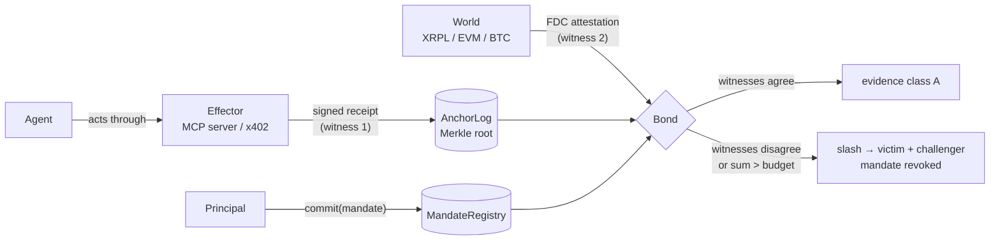

# DELICTI

[](https://github.com/dziuba0x/delicti/actions/workflows/test.yml)
[](LICENSE)


**Corpus delicti for AI agents.** Before anyone is judged, prove the deed happened.

DELICTI is a corroboration-and-consequence layer for the actions of autonomous AI agents, anchored on [Flare](https://flare.network). It does not define yet another receipt format. It takes the signed receipts that effectors already produce (KYA-OS / Checkpoint `_meta` proofs, ACTA / ASQAV receipts, flario `x402_receipt`s) and adds the four things none of them have:

1. **Mandate before act** — a principal commits, on-chain, what the agent may do (budget, window, delegation chain) *before* the episode. Children can only narrow parents.
2. **Two witnesses to the same overt act** — the effector's receipt is witness one; Flare's Data Connector (FDC) attesting the effect in the world is witness two. Agreement is evidence. Disagreement is a *contradicted deed*.
3. **Delta over the sequence** — violations are computed against the cumulative budget of the mandate, not per action, so structuring ("salami") is caught.
4. **Consequence without a court** — a bond is slashed on proof, pattern lifted from FAssets' challenger role. Challenger gets 10%, the harmed party gets the rest.

> When a mind becomes alien, its words stop being evidence. Its deeds, confirmed independently, remain. — the thesis, after J. Pachocki's *An Alien Mind*.

## The loop



## Why signed receipts are not enough

| | KYA-OS / Checkpoint | ACTA / ASQAV | AP2 mandates | OAP (pre-action) | **DELICTI** |
|---|---|---|---|---|---|
| Effector-signed receipt | yes | gateway/operator | yes | gateway | consumes theirs |
| Commitment *before* the act | – | – | payments only | policy hash | on-chain, with budget + delegation tree |
| Independent confirmation the effect happened | – | – | – | – | **FDC (second witness)** |
| Detects structuring across many small calls | – | – | – | admitted gap | **sum over sequence** |
| Consequence without a court | – | – | – | – | **bonded slash** |
| Survives the operator's bankruptcy | if they keep logs | Bitcoin/Rekor anchor | – | – | neutral chain |

A receipt proves *registration*. "A false claim can be immutably registered." DELICTI proves the *deed* — or proves the receipt lied.

## Status — Sprint 0 (Coston2)

| Piece | State |
|---|---|
| `MandateRegistry.sol` — commitments, delegation tree, monotonic narrowing, revocation | tests pass |
| `AnchorLog.sol` — per-mandate sequence of Merkle roots over receipts; refuses dead mandates | tests pass |
| `Bond.sol` — `challengeFalsePayment`: anchored receipt × FDC `ReferencedPaymentNonexistence` → slash | tests pass (mock FDC); live `FdcVerification` resolution verified on a Coston2 fork |
| `Receipts.sol` — normalized "overt act" leaf bound to the original third-party receipt | done |
| `scripts/contradicted-deed.sh` — live end-to-end on Coston2: testXRP nonexistence → FDC proof → slash | **done, executed on Coston2** |
| flario: `mandate_ref` in `x402_receipt` | next |
| `Bond.challengeBudgetOverrun` + `scripts/structuring.sh` — five 1-FLR deeds under a 4-FLR budget, each corroborated by FDC `EVMTransaction`, sum convicts | **done, executed on Coston2** |

### Live on Coston2 (2026-09-08)

Current deployment (v0.2, `Receipts.Leaf.ref`): `MandateRegistry` `0x52A61f0B9312042c514B0aC5C053747B0EdF0C17`, `AnchorLog` `0x10F4e4bc90d483B9E1D6c90EE6d6275FF825D2ae`, `Bond` `0x84Da6082Ba9f453d6aE59A0A3f868F6A1C35046E`.

**Structuring proven (mandate #4):** five transfers of 1 C2FLR to `0x2222…2222` under a 4 C2FLR budget — each one legal alone, each corroborated by its own FDC `EVMTransaction` proof (rounds 1448936–1448937, `sourceAddress` == the mandated agent) — then `challengeBudgetOverrun` with all five: `0xa547ebada6b01953100ed2fad6abdead1b3122d3d280ad302040e69b3f96557f` (291,855 gas) → slashed, mandate revoked. This is the pattern pre-action gates cannot see, because every call passes on its own.

**First contradicted deed (v0.1 deployment):** `MandateRegistry` `0x307cF47DB74a48CFC9813c59F29B1a2c546746d5`, `AnchorLog` `0xed65258EC80fAE6b780215aA17E1AB7A321d41E8`, `Bond` `0x6b4Dc7E1F6eda9B8D2ECa97dDF35e1E19A3E1ed2`.

- FDC request (`ReferencedPaymentNonexistence`, testXRP, round 1448919): `0x2fb195a324e9eb4cf518e6cb88a234ec037e03be274ea6ec7d17a5b20460d13e`
- mandate #1 committed: `0x8e6bae06d25aa959a73080a7902ffc34aa1c0be7284e66168df8295f65393c92`; false receipt anchored: `0x43c8bd629abdb551cfaeee84906546fd21170f0b89b3ba1c4ae352f500f95ace`; bond 1 C2FLR: `0x0bc4f479decb87abdac5059c93f6527d2cfe2251030db69845db91140662181b`
- **challenge with the real FDC proof → slashed, mandate revoked**: `0x91bb190933e9e0d5abbc8efc2816ba26d475c2fa3cfbfb2636ae656e3c5fdc91` (159,787 gas)

Verified on Coston2 (chain 114): `FdcVerification` `0x906507E0B64bcD494Db73bd0459d1C667e14B933`, `Relay` `0xa10B672D1c62e5457b17af63d4302add6A99d7dE`, FDC protocol id `200`.

## Build & test

```bash
npm install                      # pulls @flarenetwork/flare-periphery-contracts
forge build
forge test                       # unit tests with a mock FDC
forge test --fork-url coston2 --match-contract Coston2ForkTest -vv   # live wiring
```

Deploy to Coston2: `forge script script/Deploy.s.sol --rpc-url coston2 --broadcast --private-key $PK`

## Evidence classes

DELICTI names what it can and cannot prove:

- **A** — two witnesses agree (receipt + FDC attestation of the effect).
- **B** — one witness; the effect is not observable in the world (e.g. an email sent).
- **C** — self-report only.

## Threat model, honestly

- A compromised effector can sign false receipts. That is exactly why witness two exists: FDC does not trust the effector.
- FDC finality is minutes, not seconds. DELICTI is evidence after the fact, not a real-time brake (a mandate check hook is left in the spec for effectors that want one).
- Web2 effects need allow-listed sources on FDC; Sprint 0 corroborates on-chain and XRPL/BTC/DOGE effects only.
- Whitehat only. Everything runs on Coston2 / forks. Never real mainnet with other people's funds.

## License

MIT — Dziuba Technology.
